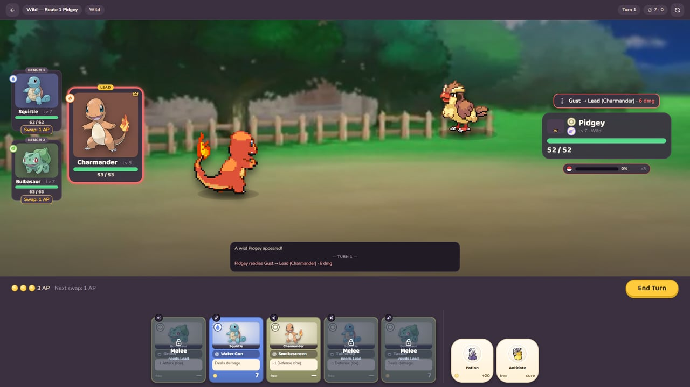
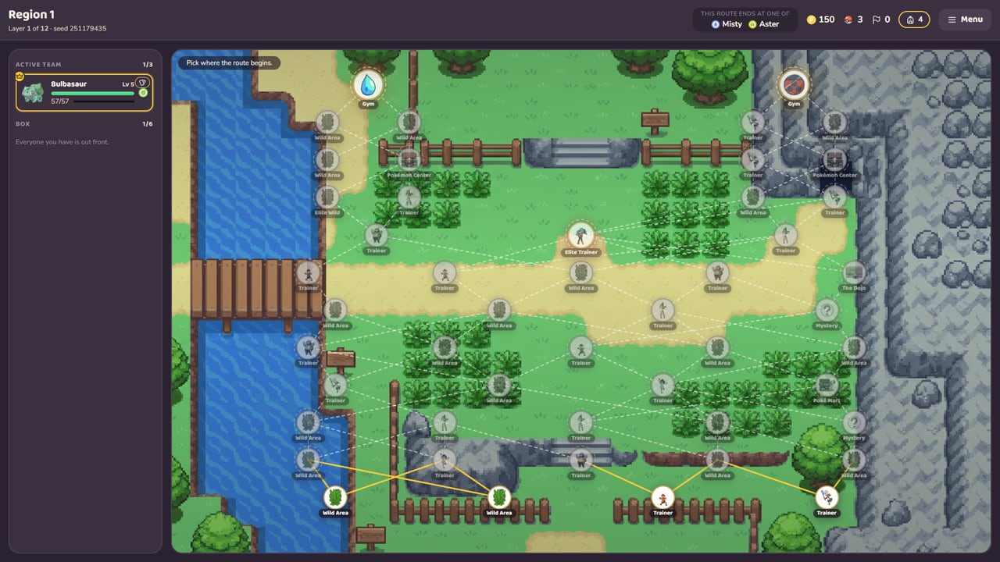

# Pokémon Ascendant

A roguelike deckbuilder where **your party is your deck**.

**▶ Play it in the browser: https://montuuh.github.io/Pokemon-Ascendant/**

> Unofficial, free, non-commercial fan project. Not affiliated with, endorsed by or connected to Nintendo,
> Creatures Inc., GAME FREAK inc. or The Pokémon Company. Pokémon and all related marks are their trademarks.



## How a fight works

- **Three active Pokémon, four moves each — that is your twelve-card deck.** You draw five skill cards and two
  item cards a turn and have **3 action points** to spend them with.
- **One of the three is the Lead.** It takes every single-target hit. **Melee** cards can only be played by the
  Lead; **Ranged** cards can be played from the bench.
- **Swapping the Lead is never free.** The first swap of a turn costs 1 AP, the second 2, the third 3. Some
  moves step a Pokémon forward or back as part of their effect — those are the swaps you *want*.
- **Every enemy move is telegraphed.** You see what it will do, to which slot, for how much, before you commit
  a card. The game is about answering what you can see, not gambling on what you cannot.
- Statuses, stat stages, type matchups and critical hits work the way you expect from the series. Gym Leaders
  and Elite fights have **multi-phase aces** that change behaviour at HP thresholds. Wild Pokémon can be
  **caught** — the gauge is deterministic, and a caught Pokémon joins your Box mid-run.



## How a run works

- **Region 1 is twelve layers of nodes** — wild fights, trainers, an Elite Trainer, a Pokémon Centre, a Poké
  Mart, a Dojo, Mystery Events, and sometimes an Elite Wild you can catch or defeat but not both.
- **The route forks.** Two of the Region's four Gyms are drawn per run and named on the map from the first
  node. The path splits at layer 8 into two lanes that never rejoin, and each lane *looks like* its Gym for four
  layers — caves and Hikers on the way to the Rock Gym, rivers and Swimmers on the way to the Water Gym. Plan in
  the trunk, commit at the fork.
- **Your Box holds six Pokémon; three are active.** Recruit from wild fights, choose who fights before each
  node, and decide who leaves when the Box is full.
- **Evolution is a choice.** At the threshold you pick an **archetype** — Vanguard, Specialist or Support — and
  the branch rewrites part of that Pokémon's four cards. The same species can become a different fighter every
  run.
- **A fainted Pokémon comes back, marked.** Each faint adds a stack of **Trauma** that lowers max HP until a
  Centre treats it. Money buys items, tutor moves, therapy — and never quite enough of all three.
- **Relics** are run-long passives; **held items** are one-per-Pokémon; a **Region Modifier** chosen at the start
  changes one rule for the whole Region; beating the Gym wins a **Badge** and a **1-of-3 Legendary relic**.
- **The account outlives the run.** Every fight, recruit and Badge pays **Trainer XP**; each level hands out
  something on a 30-row track — starters, relics, Hub conveniences, **Tokens** for the Poké Mart's Tier-3 lane.
  The **Pokédex** turns fights into knowledge: fight a species enough and its intents are revealed, your own
  copies turn shiny, and its line earns a fifth card. Twenty-four achievements so far.

## Status

**v0.6 — Meta (code).** One full Region end to end, and an account that carries across runs: 47 species,
181 moves, 64 relics in three meta tiers, 19 held items, 17 Region Modifiers, 4 Gyms, the Trainer Hub with its
four kiosks. Next is v0.7 *Regions 2 & 3*. The full plan with exit criteria is in [`docs/roadmap.md`](docs/roadmap.md).

## Run it locally

```bash
npm install
npm run dev        # http://localhost:5173
```

```bash
npm run check      # typecheck, lint, 333 unit tests, design-doc guards
npm run e2e        # 45 Playwright tests, including a full run played through the UI
npm run balance    # auto-player win rates per starter
```

Node ≥ 20. Playwright uses the system Chrome.

## Under the hood

TypeScript · React 19 · Vite · Vitest · Playwright · Zustand · Zod. The simulation in `src/sim` is pure and
deterministic — a seed and an input log replay a fight identically, which is what the golden-master tests and
the balance harness are built on. The UI is a view over it.

| | |
|---|---|
| [`docs/design/`](docs/design/) | The design canon — ten topics, every rule stated once. Code cites it by section (`§3.3.1`) and a guard proves every citation resolves. |
| [`docs/design/catalogs/`](docs/design/catalogs/) | Every species, move, relic, item, trainer and event, authored here first. |
| [`docs/architecture.md`](docs/architecture.md) | How the code is organised and why. |
| [`docs/art/pipeline.md`](docs/art/pipeline.md) | Where each asset comes from. Pokémon, items, badges and backdrops are the real ones; the two scenes are generated. |

Successor of *Project Ascendant*, a Unity build of the same design; the code was re-implemented for the web
where the iteration loop is fast. See [`docs/migration/from-unity.md`](docs/migration/from-unity.md).

## Licence

The code, design documents and original assets are **MIT** — see [`LICENSE`](LICENSE). The Pokémon material is
not covered by that licence and is not mine to license: it is © Nintendo / Creatures Inc. / GAME FREAK inc.,
included on non-commercial fan-work terms, and itemised in [`docs/art/ATTRIBUTION.md`](docs/art/ATTRIBUTION.md).
