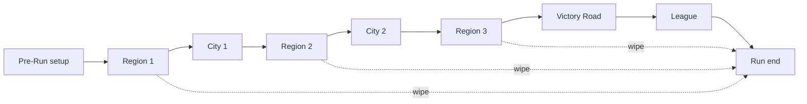

# Topic 2 — The Run

> **Canon.** `§` numbers are an API cited from code and tests — never renumber or delete a section.
>
> **This topic owns everything outside a fight:** the shape of a run, the Box and Active Team, the HP economy,
> the map and every node on it, the Cities, and Victory Road.
> **It does not own:** what happens once a fight starts (Topics 3–5).

---

# §2.1 The Run

A run goes from choosing a starter to either defeating the Champion or losing your Active Team. It has five
phases.



## §2.1.1 Pre-Run setup

Four choices, in this order, all reversible until the first node is entered:

1. **Difficulty** — zero or more opt-in modifiers (§8.8). Baseline is the floor.
2. **Starter** — one from the unlocked pool. Default: Bulbasaur, Charmander, Squirtle (§8.5).
3. **Starting Relic** — one of three, always Common or Uncommon, never Rare or Legendary (§8.6.3).
4. **Region Modifier** — one of three, applying to Region 1 only (§2.11.3).

Confirming the Region Modifier **locks the run**: the seed is fixed and the map is generated. The Box contains
only the starter; the Active Team is that one Pokémon until you recruit more.

## §2.1.2 Region traversal (×3)

Each Region is a seeded branching map of 12 layers that ends in a **Gym fork** — two routes leading to two
different Gym Leaders, both announced when you choose. Full layout, node types and generation rules: §7.2.

Node categories:

| Category | Nodes |
|---|---|
| Combat | Wild Pokémon Area · Trainer Battle · Elite Trainer · Elite Wild |
| Utility | Pokémon Center · Shop · Dojo · Mystery Event |
| Climax | Gym Leader (the Region's final layer) |

Between nodes the player has the **Map View** (§2.1.2.1); on entering a node, the Active Team locks.

### §2.1.2.1 Map View

The persistent between-nodes screen. From here the player can:

- Reorder the Box and select the Active Team of 3, including which one leads (§2.3).
- Inspect any Pokémon: moves, level and XP, current HP, Trauma, evolution readiness, ability, held item.
- Configure each Pokémon's **active 4** moves from its pool (§6.7) — free and unlimited.
- Equip and unequip Held Items (§7.4).
- Trigger a pending evolution (§6.3).
- Use a TM (§6.4.1).
- Save and quit. The game autosaves on every node entry.

## §2.1.3 Region climax: the Gym

The final node of every Region is the Gym Leader on the route you chose. Two Pokémon, sequential, the second a
three-phase ace; the leader plays on a **Home Field** of its own type (§4.3.5). Full design: §5.9.

Defeating it awards a **Badge** (a permanent run modifier, §5.10), a guaranteed **Rare relic**, a 1-of-3
**Legendary relic** pick (§7.3.7), 500 ₽, and passage to the next phase.

## §2.1.4 Cities (after Gyms 1 and 2)

A City is a **lobby**: a drawn town you stand in, with its notable buildings as doors, and a gate that leaves
for the next Region when *you* say so. There is no visit budget and no timer — the budget is your money, your
HP and your Trauma. What stops you taking everything is that everything costs.

Two per run, and they are deliberately different sizes:

| | **Pallet Town** — after Gym 1 | **Celadon City** — after Gym 2 |
|---|---|---|
| Feel | A small town: four doors, cheap, warm | The big city: more doors, dearer, louder |
| Doors | Pokémon Center · Poké Mart · Dojo · Safari Zone *(closed)* | Pokémon Center · Department Store · Dojo · Game Corner *(Black Market beneath it, closed)* · Safari Zone *(closed)* |
| Leaving | The gate → Reflection (§2.11.3) → Region 2 | The gate → Reflection → Region 3 |

**The city is where a team is built.** Routes carry a travelling merchant and a field nurse and nothing else
(§2.9) — the real shop and the only Dojo are here. That is what makes arriving an event, and it is why money
saved on a route has somewhere to go. Full detail: §2.11. *(Redesigned 2026-09-22: the previous "Choice
Plaza", a menu of six options with a 2-of-4 visit budget, put a second Gym-tier boss one click after the
Region's own Gym and duplicated the route's own service nodes. The lobby keeps the pressure — money — and
drops the ration.)*

### §2.1.4.1 Region Modifiers are per-Region

Exactly **one** modifier is active at a time. It is chosen at the start of each Region — pre-Region 1 during
setup, then at City 1 for Region 2 and City 2 for Region 3 — and it **expires when that Region ends**.
Modifiers never stack or accumulate. Relics and Badges are the run-long stacking systems; the Region Modifier
is the per-act accent. Pool of 17: §2.11.3.1.

## §2.1.5 Victory Road

After Gym 3: a small branching zone (3–4 layers, 2–3 lanes, all converging on the Summit) with node types found
nowhere else — Gauntlet, Apex Pokémon, Training Grounds — and no healing except at the end. The hardest
non-boss content in the game and the last window to prepare. Full design: §2.12.

## §2.1.6 The League

> 🔒 **Deferred.** The League is designed but not built. The build order finishes the Region 1 → Victory Road
> loop first (roadmap v0.8). The spec stands; do not implement ahead of it.

Five sequential fights with no map: Elite Four ×4, then the Champion. Between fights, a **micro-rest** restores
30 % of Effective Max HP. No shop, no recruitment. Defeating the Champion wins the run. Full design: §5.11, §5.12.

## §2.1.7 End of run

| Outcome | What happens |
|---|---|
| **Won** | Full Trainer XP + victory bonus + run summary; later, a leaderboard submission |
| **Lost** (Active Team wiped) | Run state is discarded; Trainer XP is still awarded, scaled by progress: `floor(layersCleared × 50)`, capped at 400 (§8.3.2) |

Either way the player returns to the Trainer Hub, and either way the run made the account stronger. That is the
"failure is fuel" guarantee of §6.1.

---

# §2.2 Region escalation is mechanical, not numeric

Later Regions must not feel like Region 1 with bigger numbers. Each introduces a **mechanical accent**:

| Region | Theme | Accent |
|---|---|---|
| **1 — Verdant Route** 🌿 | Meadow, river, cave | Baseline. The teaching Region |
| **2 — Coastal Cliffs** 🌊 | Sea, river, power plant | **Status conditions on enemy intents** become routine |
| **3 — Volcanic Highlands** 🔥 | Volcano, cave, sky, tower | **Multi-enemy encounters** (1 lead + 1–2 supports) and **field effects** |
| **League** | — | Everything at once, plus one signature mechanic per boss |

Enemy levels rise too, of course — but the escalation the player *notices* is the new rule, not the bigger
number. Region aesthetics and rosters: §2.13.

---

# §2.3 Box and Active Team

| | |
|---|---|
| **Box** | The run's persistent roster. Capacity **6**, raised to 8 by a Hub upgrade or a relic |
| **Active Team** | The **3** Pokémon brought into a combat, drawn from the Box |
| **Lead** | The front slot of the Active Team, set in the Map View and changed during combat by swapping |

A Pokémon in the Box but not in the Active Team **contributes no cards** to the deck. That is the central
tension of team selection: your fourth-best Pokémon is not a backup, it is absent.

The loadout is committed with a **Confirm** gesture in the Map View and **locks the moment a node is entered**.
There is no mid-combat loadout change.

XP is a separate question — benched Box Pokémon still earn 75 % of combat XP (§6.2.1), so a Pokémon on the bench
falls behind but does not fall out of the run.

## §2.3.1 Box overflow — Swap or Skip

Recruiting at a full Box forces a choice:

- **Swap** — release one Box Pokémon permanently and take the new one.
- **Skip** — decline the recruit.

There is no deposit pool. The Box is the only storage a run has, and releasing is irreversible.

---

# §2.4 HP economy

**HP persists across combats and nodes.** A Pokémon that ends a fight at 30 % starts the next one at 30 %. This
is what turns a Region into a resource-management problem rather than a sequence of independent puzzles.

## §2.4.1 Fainted state

A Pokémon's `currentHP` reaching 0 **is** the fainted state — there is no separate flag. A fainted Pokémon
cannot be in the Active Team and stays in the Box until healed above 0.

## §2.4.2 Healing

| Event | Effect |
|---|---|
| **Full heal** (Pokémon Center, Victory Road Summit) | Every Box Pokémon to **Effective Max HP**. Revives the fainted |
| **Percentage heal** (League micro-rest 30 %, some events) | `currentHP = max(currentHP, floor(EffectiveMaxHP × pct))`. Revives the fainted |
| **Consumable heal** (in combat) | Restores a percentage of Effective Max HP (§7.2.2). Cannot revive, except `revive` |
| **Move heal** (in combat) | Same rule as a consumable |

Everything computes against **Effective Max HP** — the Trauma-adjusted ceiling (§8.2.1). A full heal never undoes
a faint; it restores you to the ceiling your faints have left you.

## §2.4.3 No in-combat revival by default

Fainting in combat permanently removes that Pokémon's deck contribution for the rest of the fight. The only
exception is the `revive` consumable (§7.2.2), which is rare and costs 2 AP. Fainting is a tactical loss, not a
speed bump.

## §2.4.4 Fainting costs more than the fight

Every faint adds a **Trauma stack** to that Pokémon instance, permanently lowering its Effective Max HP for the
rest of the run. Full system, including the three ways to clear stacks: §6.2.

---

# §2.5 The Region map

A Region is a **seeded branching tree of 12 layers** that forks near the end into two Gym routes. The same
`(runSeed, regionIndex)` always produces the same topology, node types and Gym pair — the map is stable across a
save and reload.

```
L0    ● ● ● ●               entry — 4 nodes, wild-heavy; which wild is still a choice
L1–2  ● ● ● ● ●             a Wild Area is guaranteed reachable; one Mystery at L2
L3–6  ● ● ● ● ●             trunk: Trainer / Wild / Shop (L3) / Mystery (L5) / Dojo (L6)
L7    ● ●⚔ ●                the Elite Trainer — guaranteed on the map, beside two ordinary fights
L8    ╱─────╲               THE GYM FORK — both destinations telegraphed from L0
L8–10 ●● ❤   ●● ❤          two lanes, each themed after its Gym; one Centre each
L11   👑      👑            two Gyms; you fight the one your lane reaches
```

| Layer | Content |
|---|---|
| **L0** | Four entry nodes, **wild-weighted**. Not a forced Wild — which wild, and its three species, is the choice |
| **L1–L2** | A Wild Pokémon Area is **reachable** here, so early recruitment always stays viable |
| **L0–L7** | The trunk: a lattice 4–5 columns wide, 1–3 children per node, weighted by layer |
| **L7** | One **Elite Trainer**, guaranteed *on the map* — the middle of three, so walking past it is legal |
| **L8** | The **Gym fork**: the trunk splits into two independent lanes that never rejoin |
| **L8–L10** | Each lane is **themed after its own Gym** — its biome, its species, its trainer archetype. One guaranteed **Pokémon Center** per lane |
| **L11** | Two terminal Gym nodes. The unchosen one is abandoned for the run |

**Connection rules.** Every node links to 1–3 nodes in the next layer, always within one column of its own —
a **locality rule**, and it is what reconciles "densely connected" with "clear paths". No node has more than
**3** parents (branchy, not a convergent mesh); children are a *contiguous* run of candidates, which is what
guarantees edges do not cross; no three adjacent nodes in a layer share a type; **no edge crosses lanes past
the fork**; every route reaches the fork; nothing is unreachable and nothing before a Gym is a dead end.

**No two in a row, or no three?** Canon said "no two adjacent nodes share a type" until v0.5, and it turned
out to *override* the layer weighting rather than season it: at layer 0's 9:2 Wild bias it fired on almost
every roll and dragged a deliberately wild-heavy opening down to half Wild. A row of four cannot be both
mostly-one-kind and never-twice-in-a-row. The rule is **no three in a row**, which still breaks up a wall of
identical badges and leaves a weighting alone.

## §2.5.0 Why the lanes are themed

Once the trunk forks, each lane looks like the Gym at the end of it: the Rock lane is caves and Hikers, the
Water lane is rivers and Swimmers. Pillar 1 says the game telegraphs, and a lane that *looks* like its
destination telegraphs it for four layers rather than on one signpost.

It also decides the shape of the decision. A lane's wilds are thematically **adjacent** to its Gym, not
counter to it — walk the Rock lane and you will be offered Geodudes, which do not beat Brock. The counter is
built in the **trunk**, out of a mixed pool, *before* you commit. So the run reads: plan in the trunk, commit
at the fork.

Each lane carries one **counter species** — the single entry in its pool that answers its own Gym — so a
player who committed late is behind rather than dead. `machop` in the Rock lane, `oddish` in the Water lane.

**Gym selection.** Each Region defines a pool of **4 Gym types** (§5.9.2). At generation the map RNG picks
**2 distinct** types and assigns one to each terminal node, and both are named on the map from layer 0.

**Gym selection.** Each Region defines a pool of **4 Gym types** (§5.9.2). At generation the map RNG picks
**2 distinct** types and assigns one to each terminal node. No two routes in a Region share a type — except
under the **One Path** difficulty modifier, which deliberately makes both the same (§8.8.2).

## §2.5.1 Node distribution

Per Region, across both lanes:

A map holds about **47 nodes**, of which a run walks twelve. That ratio is the point: the route you did not
take is visible the whole way up, which is what makes the one you did feel chosen.

| Node | Count | Notes |
|---|---|---|
| Wild Pokémon Area | ≈19 | Weighted heavily at L0–L1, and again inside the lanes |
| Trainer Battle | ≈18 | Archetype is free in the trunk and **the Gym's own** inside a lane |
| Elite Trainer | **1 guaranteed**, +1 at **22 %** | The guaranteed one is the middle of three at L7; the rolled one is in a lane |
| Elite Wild | **≤1, at 45 %** | Seeded special (§2.8.2) — genuinely not on every map, and never more than one |
| Field Aid | 1 per Gym lane | The nurse: half a heal before the Gym (§2.9.1). **Never before the fork** — a rest you did not need costs a fight you did |
| Travelling merchant | 1 | L3, basics only (§2.9.2). The real shop is the City's |
| Mystery Event | 3 | L2, L5 and L6 — L6 was the Dojo's node until the Dojo moved to the City (§2.9.4) |
| Gym | 2 | The terminal node of each lane |

**Why two of these are percentages.** The Elite Trainer at L7 is the landmark — guaranteed, the thing you
level for. The extra Elite and the Elite Wild are the opposite: they are why two runs on the same seed-shape
feel different. An extra Elite in a lane is a spike you route around or level into; an Elite Wild is a
catch-or-kill dilemma you may never meet.

## §2.5.2 Generation

The map is built from the run seed via the map RNG stream (§10.7.2). Constraints are applied iteratively with
re-rolls, capped at eight retries; in practice it converges in about five.

On resume, the map is **re-derived by replaying the map RNG from the Region's entry state**, never restored from
a saved cursor — restoring mid-Region state would generate a different map (§10.8.6).

---

## §2.5.3 Historical: the pre-v2 map

> The first design used an 8-layer fixed-lane ladder with a forced Wild at layer 0, the Elite pinned to layer 3,
> the Center pinned to layer 6 and the branch point at layer 4. It was replaced by the 12-layer branching tree
> of §2.5 because fixed lanes made every run's shape identical, the forced opening Wild wasted the first
> decision, and a single branch point made the Gym choice feel arbitrary rather than earned. Recorded here so the
> change is legible; do not implement it.

---

# §2.6 Wild Pokémon Areas

The recruitment workhorse.

## §2.6.1 Biomes

| Biome | Regions | Primary in | Theme |
|---|---|---|---|
| **Meadow** 🌾 | R1, R2 rare | **R1** | Normal, Bug, Grass |
| **Cave** 🕳️ | R1, R2, R3 | — | Rock, Ground, Fighting, dual types |
| **River / Lake** 💧 | R1, R2 | — | Water, Bug-Water |
| **Sea** 🌊 | R2 | **R2** | Deep-water Water, Ice |
| **Power Plant** ⚡ | R2, R3 | — | Electric |
| **Volcano Slope** 🔥 | R3 | **R3** | Fire, Rock-Fire, Ground |
| **Sky / Cliffs** 🦅 | R3 | — | Flying, Bug-Flying, Psychic |
| **Abandoned Tower** 👻 | R3 rare | — | Ghost, Poison, Psychic |

Each Region has a fixed eligible set and a primary biome that appears most often. **Biome-to-Region binding is
canon**: biomes always follow the Region's theme, and Region Modifiers never steer them — with one deliberate
exception, **Naturalist's Lens** (§2.11.3.1), which lets the player promote one *eligible* biome to primary for
that Region. Dominant, never exclusive, so the three-species offer never starves.

**A biome is a species pool and a backdrop, and it must be wide enough to surprise.** Region 1 shipped with
four to six species per biome, which is thin enough that a lane starts repeating itself by its third node; the
pools grow as Regions 2 and 3 author their lines, and a species may sit in more than one biome. A pool that
offers the same three Pokémon twice is the failure state to watch for. *(Noted 2026-09-22.)*

**Biomes will also carry a field effect** — most visibly in the lane that ends at a Gym of that biome's type,
so the ground you fight on is part of what the lane telegraphs (§2.5.0).

> ⚠️ **OPEN (2026-09-22)**: which effect each biome carries, and whether it applies to the whole lane or only
> near the Gym. Waits on field effects themselves (§4.3, v0.8). Decides: user.

## §2.6.2 What a Wild node offers

**Three species, visible before you enter** (Pillar 1 applies to the map too):

- 2 Common from the biome's pool,
- 1 Uncommon,
- and about 10 % of nodes per Region upgrade that Uncommon slot to a **Rare**.

The `lure-module` relic makes it four. Pick one, and you enter a catching encounter with that species.

## §2.6.3 Species pools

Full Region 1 pools with dex numbers, stats, learnsets and archetypes:
[`catalogs/species-r1.md`](catalogs/species-r1.md). Regions 2 and 3:
[`catalogs/species-pool-r2-r3.md`](catalogs/species-pool-r2-r3.md). Summary for Region 1:

| Biome | Common | Uncommon | Rare |
|---|---|---|---|
| Meadow | Caterpie · Weedle · Pidgey · Rattata | Oddish · Bellsprout · Mankey | Eevee |
| Cave | Zubat · Geodude · Diglett | Onix · Machop | Aerodactyl · Lapras |
| River | Magikarp · Poliwag | Psyduck · Krabby | Lapras |

A species that appears in two biomes is the same species with different flavour text, not a variant.

## §2.6.4 Catching

Catching is a **roll at a number you can see**. Weaken or status the target, watch the chance climb, throw
when the odds are worth a ball. *(Redesigned 2026-09-21 — the deterministic gauge it replaces is in
§2.6.4.3.)*

### §2.6.4.1 The encounter

1. The wild Pokémon appears at full HP. Your Active Team enters at its current HP. **It never flees.**
2. If the run holds at least one Pokéball, a **Pokéball card** joins the consumable pile for this combat. With
   zero balls, no catch card appears and the map HUD shows why (`◓ 0`).
3. Combat proceeds normally.
4. To catch it, play the Pokéball. The card is playable at **any** odds; the throw is the player's call.

**The chance**

```
p = catchRate(species) × (1 − 0.9 × HP%)^1.7 × status × ball        clamped to [1 %, 90 %]
```

| Term | Value |
|---|---|
| **catchRate** | The species' ceiling, at ~0 HP with a Poké Ball. By default rarity × stage: common 0.90 · uncommon 0.70 · rare 0.50 · legendary-class 0.20; ×0.65 for a middle stage, ×0.40 for a final. A species row may set its own (`catchRate`; Snorlax is 0.20) |
| **HP** | The steep part: the last quarter of the bar is worth more than the first three |
| **status** | ×1.5 if the target is Asleep or Frozen · ×1.2 for any other condition or Confusion |
| **ball** | Poké Ball ×1 (§2.6.4.2 for the others) |

Anchors, Poké Ball on a common basic species: **full HP ≈ 2 %** · half HP 33 % · a quarter 58 % · a tenth
77 % · asleep at a quarter 87 % · the cap is 90 %. A Snorlax at full HP sits on the 1 % floor.

| The throw | Result |
|---|---|
| Roll ≤ p | **Caught.** Combat ends |
| Roll > p | **Broke free.** The ball is spent, the fight goes on, the enemy's turn comes |
| Target at 0 HP | The recruit is lost |

The chance is printed on the pill beside the enemy and on the ball card, and the tooltip says what moves it.
The roll comes from the fight's own RNG stream, so a replay throws the same ball (§10.7). **Master Ball
Charm** (§8.6.1) arms one throw per run that cannot miss; the pill reads SURE while it is armed.

5. On a catch: combat ends as a **Victory** with **full combat XP** — a catch is never worth less than a kill —
   and the Pokémon enters the Box, or triggers Swap-or-Skip if the Box is full (§2.3.1).
6. On a team wipe: the run ends as normal.

**Balls are a counted run resource:** start with 3, +1 per Region, buyable at 50 ₽, and **one is spent per
attempt whether it succeeds or fails**.

### §2.6.4.2 Higher-tier balls

Post-launch. A Great Ball multiplies the chance ×1.5, an Ultra Ball ×2, both under the same 90 % cap. The
architecture already carries a `ballMultiplier` per ball.

### §2.6.4.3 Why a roll, and why a shown one

From v0.1 to v0.6.0 catching was **deterministic**: a gauge filled as HP fell and the ball caught for certain at
READY (HP ≤ 30 %, or ≤ 50 % with a status). It aligned with Pillar 1 and it had one problem in play: the moment
before READY had no decision in it — a throw either could not happen or could not fail — and "wearing it down
to 30 %" felt like a chore rather than a gamble. The user asked for the franchise's shape back on 2026-09-21:
a chance that is never zero, that rises with damage and status, and that differs by species.

The redesign keeps what Pillar 1 actually protects. The number is **on screen before the throw**, exact, with
its causes in the tooltip; nothing about *how much* is being risked is hidden. What the dice decide is only
whether *this* ball was the one — and a miss costs a ball and a turn, which is a price the player chose to pay
at a percentage they read. Balancing of ball counts and prices waits on the consumables decision (§7.2).

## §2.6.5 Wild stat tiers

| Region | Recruit level |
|---|---|
| 1 | 5–11 |
| 2 | 12–20 |
| 3 | 22–30 |

**The band walks with the route.** A Region's span is not applied flat to every node: layer 0 draws from the
bottom of the band and the layer before the Gym from the top, two levels wide at any point. Region 1 therefore
opens at Lv 5–6 and finishes at Lv 10–11.

A flat band was the first thing the whole-run harness (`src/sim/balance/autoRun.ts`) rejected: it made the
opening node as dangerous as the last one, and a starter that has fought nothing yet meets the same Lv 10
Pokémon a fully-recruited team does. Ramping the band is what lets layer 0 be a real choice rather than a
coin flip on whether the route opened kindly.

A late-Region recruit spawns near the top of its layer's band and derives its known moves from that level
(§6.9), so recruiting late is a real option rather than a wasted node.

---

# §2.7 Trainer Battles

A human trainer fielding **1–2 Pokémon sequentially** — the second enters when the first faints. Distinct from
Elites (§2.8) and Gyms (§5.8).

## §2.7.1 Archetypes

| Archetype | Identity | Regions |
|---|---|---|
| **Bug Catcher** | High volume, low individual threat; Confusion and Sleep riders | R1 |
| **Youngster** | Generalist; the difficulty floor | R1, R2 |
| **Lass** | Generalist with a status lean | R1, R2 |
| **Hiker** | Slow, durable, Defence-stacking; punishes a damage race | R1, R2 |
| **Swimmer** | Water, status-heavy | R1 (river), R2 |
| **Engineer** | Buff-stall: sets up, then strikes | R2, R3 |
| **Hex Maniac** | Vision disruption — generates Unknown intents | R2, R3 |
| **Rocket Grunt** | Aggressive Cleave and Backstrike kits, Poison | R2, R3 |
| **Ace Trainer** | Two high-stat Pokémon, multi-type | R3 |

Rosters, levels and rewards for all 21: [`catalogs/trainers.md`](catalogs/trainers.md). Each archetype has two
Region-1 variants so a Region with four trainer nodes never repeats a team.

## §2.7.2 Rewards

| Reward | Value |
|---|---|
| Trainer XP (meta) | 5 |
| Poké Dollars | 50–150 (R1) · 120–260 (R2) · 200–400 (R3) |
| Loot | 50 % Common item / 30 % Common relic / 20 % Uncommon item, seeded |
| Held Item | 20 % chance |
| TM | 5 % chance |
| Pokédex | Each defeated Pokémon counts toward its species' kill thresholds (§5.13) |

## §2.7.3 Generation

The seed picks an archetype from the Region's eligible list, without replacement within a Region. Eligibility
expands by Region: Bug Catcher is Region 1 only, Rocket Grunt is Regions 2–3, Ace Trainer is Region 3.

**A node fixes its roster when the map is generated**, not when you walk in. The preview and the fight read the
same list, so a preview can never turn out to have been a guess (Pillar 1).

**Authoring rules.** A trainer's level band is **its layer's** wild band +1 to +2 (§2.6.5) — a step up from a wild fight,
not a boss. The archetype must be readable from the team at a glance, because the node preview names it and the
player counter-picks their Active 3 from it. No hidden intents at baseline. And no trainer fields a fully-evolved
Pokémon before the player could plausibly have one; the Gym ace is the deliberate exception.

---

# §2.8 Elite nodes

Two node types sit above Trainer Battles and below the Gym.

## §2.8.1 The Elite Trainer

A human mini-boss: **2 Pokémon, 2 phases each** (the Rival's Region 3 ace gets 3 and evolves mid-fight).
Guaranteed once per Region in the late trunk. **No type lock** — that identity belongs to Gyms, which makes the
Elite a different kind of test from the Gym ahead of it.

**Reward:** a **Rare relic, choice of 1 of 3**, plus ~300–500 ₽ and 25 Trainer XP.

**Who shows up** is seeded per Region:

| Region | Rival | Giovanni | Specialist |
|---|---|---|---|
| 1 | 80 % | — | 20 % |
| 2 | 60 % | — | 40 % |
| 3 | 40 % | 30 % | 30 % |

**The Rival** is the recurring named antagonist — a pure skill check with a balanced multi-type team, and the
"you again" beat. It **scales by Region band rather than by how many times you have met it**, so an
RNG-skipped Region never breaks the curve: 2 Pokémon in Region 1, 3 by Region 3, with a three-phase ace that
evolves mid-fight.

The Rival's starter line **counter-picks yours** — it takes the starter that beats the one you chose. It is the
Gen I beat everyone remembers, and it makes the same fight different every run.

**Giovanni** appears at this node in Region 3 and can *also* be drawn as the Viridian Ground Gym Leader. Both
lanes are canon; a run may defeat both.

**Specialists** are elevated versions of the trainer archetypes — a Karate King, a Channeler, a Cooltrainer —
one authored per Region. Rosters: [`catalogs/elites.md`](catalogs/elites.md).

## §2.8.2 The Elite Wild

A **catchable boss-wild**: the Region's mini-boss with a catch-or-kill dilemma.

| Choice | How | Reward |
|---|---|---|
| **Catch it** | Fill the Catchability gauge and throw | Victory, full XP, and the **rare recruit** |
| **Defeat it** | Reduce it to 0 HP | Victory and a **single Rare relic**, no choice |

Catching is the premium path by design, because the Elite Trainer already owns the "pick 1 of 3" beat.

**Profile:** boss-tier HP, two phases, no evolution (it is a wild, not an ace), everything telegraphed.

**Phase 2 makes it *easier* to catch, not harder.** As the boss-wild tires, its catch threshold rises — the
gauge fills faster for the same damage. The opposite design, where Phase 2 raises its defence, means the catch
window narrows exactly when the player is reaching for it, which punishes the interesting choice. "It is
tiring — throw now" is the readable story. *(Decided 2026-09-19.)*

**Generation:** a seeded special node, at most one per Region, **not on every route** — modelled on the Victory
Road Apex node. It carries its own map marker.

**Region 1 occupants** (one is drawn per encounter, never both):

- **Snorlax** — a Normal route-blocker. Phase 1 stalls (Rest heals 50 % and self-sleeps, Snore, Amnesia), Phase 2
  attacks (Body Slam with a Paralysis rider, Crunch). Thick Fat and Immunity. Catching it recruits Snorlax.
- **Marowak's Spirit** — a Ghost boss-wild in the Pokémon Tower vein. Curse costs it 25 % of its own HP to inflict
  a three-turn drain; Confuse Ray, Shadow Bone, Lick. Levitate and Cursed Body. **Catching it lays the spirit to
  rest and recruits a living Ground-type Marowak**, which arrives holding a Thick Club (+50 % Melee, Marowak
  only).

---

# §2.9 Service nodes

Two non-combat stops, and both of them are small. A route sells you what you need *today*; the City sells you
what you are building (§2.11). Every service node still costs something, even the free one — a node you spend
on healing is a node you did not spend on a fight.

*(Rewritten 2026-09-22. Until then a route carried a full Pokémon Center, a Shop and a Dojo, and the City
carried premium copies of all three, which made a City "the route again, dearer". The economy moved wholesale:
routes keep a nurse and a pedlar, Cities keep the shop and the Dojo. The consequence is deliberate — you save
across a Region and spend it all at once.)*

## §2.9.1 Field Aid — the nurse

One per Gym lane, just before the Gym. No combat, no building: a nurse with a folding table.

| Service | Effect | Cost |
|---|---|---|
| **First aid** | Restores **50 %** of Effective Max HP to every Pokémon in the Box, and cures **every status** — they all outlive the fight that inflicted them (§4.2.7.1) | Free |

That is the whole list. She does not treat **Trauma** — that is a Pokémon Center's job and Centers are in
Cities now (§2.11.1). Half a heal before a Gym is enough to make the fight winnable and not enough to make it
comfortable, which is the point of the last stop before a boss.

---

## §2.9.2 The travelling merchant

One per Region, mid-trunk, at L3. A cart, four slots, basics only.

| Slot | Content | Price |
|---|---|---|
| 1–2 | Tier-1 consumables — potions, status cures | 25–150 ₽ |
| 3 | Poké Balls ×3 | 120 ₽ |
| 4 | Wildcard — a Common relic **or** a Held Item | 150–250 ₽ |

Stock is seeded per visit. The merchant does **not** buy anything: selling exists only in a City (§2.11.2.4).

## §2.9.3 Re-rolling

The merchant re-rolls **once**, for 25 ₽. The City shop keeps the full ladder — 25 ₽, then 50 ₽, then 100 ₽,
up to three per visit — because that is where the stock is worth fishing for.

---

## §2.9.4 The Dojo

**The Dojo is a City building** (§2.11 — one in the town, a wider one in the city). It is documented here
because this section is where the rules live and thirty citations point at it; only its *location* changed on
2026-09-22.

A non-combat utility screen. Pick one of your Pokémon and pay Poké Dollars to teach it:

- **An off-learnset move** — the full tutor list for that Pokémon's **current evolution stage**, minus what it
  already knows. There is **no offer cap**: every available move is listed. These are the moves the Pokémon
  would never learn naturally under the lean learnset of §6.9, which is exactly what makes them worth money.
- **An ability** — any entry from the species' `availableAbilities` pool, including the one currently equipped,
  so a swap is allowed. One passive slot per Pokémon; teaching replaces what is there. The line's **hidden
  ability** appears here once its Bond reaches rank 3 (§6.8.3), locked and named before then.

You may teach several things in one visit if you can afford them, and you may leave and come back.

| | Town Dojo | City Dojo |
|---|---|---|
| Off-learnset move | 150 ₽ | +30 %, and a wider list |
| Ability (set or swap) | 200 ₽ | +30 % |

The Dojo is the game's main Poké Dollar sink and its key deliberate-sculpt stop — the place where a run stops
being what it was dealt and becomes what you built (Pillar 3). Region 1 has no Dojo at all, which is the
teaching Region's own escalation: you play what you find until the first town.

A third counter — **extra moves** beyond the tutor list — is drawn in the Dojo and marked in development
(§2.11.6). Gen I **HMs** are a separate idea and sit in the backlog, possibly never to ship.

### §2.9.4.1 The Challenge Ring

Inside the Dojo, a second door: a **ladder of trainer fights you pay to climb**.

- **Two rungs in Pallet Town, three in Celadon City** — the big city is the big challenge.
- Each rung is a trainer stronger than the last, and **you see the next rung's team before you fight it**.
- **No healing between rungs.** HP, statuses and Trauma carry from rung to rung, as between any two fights.
- After each rung won, you choose: **cash out** — take everything the ladder has paid so far and leave — or
  **climb**. Losing a rung loses everything earned on this ladder, and the fallen keep their Trauma. It never
  ends the run.
- Once per City visit (§2.11.0).

The decision *is* the design: "two down, my Lead at half HP and asleep, and the third is a Fire team — do I
stop?" Every rung is chosen with the next opponent in view (Pillar 1), and the ladder reuses the trainer-battle
generator. *(Chosen by the user on 2026-09-22 over a single all-or-nothing master fight and an endless
survival ladder.)*

It replaced the **City Gym** of the previous design — a full Gym-tier boss one click after the Region's own
Gym — and, unlike it, **pays no Badge** (§2.12.6).

**What it pays.** Money on the lower rungs; the top rung pays what money cannot promise — a **Rare relic,
1 of 3**, as after an Elite Trainer (§2.8.1). Cashing out takes everything paid so far.

| | Entry | Rung 1 | Rung 2 | Rung 3 |
|---|---|---|---|---|
| **Pallet Town** | 250 ₽ | 300 ₽ | Rare relic, 1 of 3 | — |
| **Celadon City** | 400 ₽ | 400 ₽ | +600 ₽ | Rare relic, 1 of 3 |

The money tempts an early stop; the relic is the reason to risk the last fight. A Rare in the City shop costs
600 ₽ and is on the shelf half the time (§2.11.2.2), so *choosing* one from three is worth well over its price.
*(Chosen 2026-09-22 over all-money prizes and a player-chosen stake, which duplicated the Game Corner.)*

**How hard it is — it is meant to be lost.** The Ring is a hard challenge where losing is the normal outcome.
Targets, measured by the balance harness with the team a run actually brings to the City:

| | Rung 1 won | Whole ladder cleared |
|---|---|---|
| **Pallet Town** | about half | about **1 in 6** |
| **Celadon City** | about half | **under 1 in 10** (rung 2 about a quarter) |

Rung 1 is winnable on purpose: a ladder whose first step is a wall is a toll, not a gamble — the cash-out only
means something if the first prize is reachable. It is every rung after it that is brutal.

**Starting values**, which the harness tunes rather than a hand: every rung is an Elite-class trainer with a
full team; rung 1 stands at the City's Gym level **+2**, and each later rung **+3** more. In Pallet that is
Lv 18, then Lv 21, against a Region 1 Gym whose ace is Lv 16. *(The user asked for it harder than a Gym
and for the balance to be set to a low win rate, 2026-09-22.)* The fee, the prizes and the offsets are retuned
with everything else in the global balance pass (backlog).

---

# §2.10 Mystery Events

Themed vignettes with branching choices — the roguelike's story beats and the place the run gets weird.

## §2.10.1 Presentation

A flavour scene (illustration plus a short paragraph), then 2–3 choices. Each choice states its outcome up
front, unless the event is explicitly a **Gamble**.

## §2.10.2 The catalogue

Twenty-two events, with their choices and effects: [`catalogs/mystery-events.md`](catalogs/mystery-events.md).
Highlights of the canon twelve:

| Event | Choices |
|---|---|
| **Mysterious Stone** | Take it → a random Evolution Item · leave it |
| **Wandering Tutor** | A free Dojo move for one Pokémon · decline for 100 ₽ |
| **Berry Bush** | Eat now → +30 % HP to the whole Box · harvest → 3 Potions |
| **Daycare Recovery** | Clear all Trauma from one Pokémon; it skips the next combat · decline |
| **Slot Booth** | Wager 100 ₽ on a coin flip for 250 ₽ · decline |
| **Wounded Pokémon** | Heal it → a free recruit with 2 Trauma stacks · battle it at full HP · leave |
| **Trainer's Dare** | Accept an Elite-tier fight for double rewards · decline, no penalty |
| **Cursed Trinket** | Take it → a random Rare relic, 30 % chance of 2 Trauma stacks · leave |
| **Old Map** | Reveal every node 2 layers ahead · sell it at the next shop for 200 ₽ |
| **Lost Backpack** | 3 random consumables · 200 ₽ · leave |
| **Bond Ceremony** | One Pokémon gains +1 to a chosen stat permanently · leave |
| **Stat Trade** | One Pokémon swaps Attack and Defence for the run · leave |

Ten further events were authored to cover the systems the original set never touched — the deck, the Lead
mechanic, ball scarcity and the Box cap. They include **Abandoned Pokéball** (+2 balls), **Veteran's Lesson**
(free first swap every combat this Region), **Sparring Ring** (a no-stakes fight with doubled XP),
**Fossil Dig** (Aerodactyl or a Rare relic, and you cannot have both) and **Mirror Pool** (reroll an ability or
a relic).

## §2.10.3 Risk profiles

| Profile | Share | Meaning |
|---|---|---|
| 🟢 **Safe** | 30 % | Every choice is net-positive or neutral |
| 🟡 **Tradeoff** | 50 % | Net-positive at a clear, stated cost |
| 🔴 **Gamble** | 20 % | At least one choice has an explicitly unknown outcome |

The badge is **visible on the map node before you enter**. Pillar 1 holds even inside "Mystery": you always know
what *kind* of uncertainty you are walking into.

## §2.10.4 Repeatability

An event fires at most once per run — it leaves the seeded pool as soon as it is used.

## §2.10.5 Effect vocabulary

A choice is data, not a script. The closed list of effects a choice may apply is in the catalogue, so a new
event needs no new code: grant item / relic / money / balls, heal the Box, clear or add Trauma, recruit, start a
combat, reveal the map, boost or swap stats, upgrade a consumable, reroll an ability or relic, change the next
node's type, adjust hand size or swap cost, multiply XP.

---

# §2.11 Cities

Two stops per run, after Gyms 1 and 2. A City is a **lobby**, not a menu: the city is drawn, its buildings are
the doors, and you walk out through the gate when you are ready (§2.1.4).

## §2.11.0 How a lobby works

- **No visit budget.** Enter what you like. Money, HP and Trauma are the only rations.
- **Two kinds of door.** The **open** ones — Pokémon Center, shop, Dojo, Game Corner — may be entered and left
  as often as you like; they take your money, not your turn. The **committing** ones — the Challenge Ring
  (§2.9.4.1) and, when it opens, the Black Market (§2.11.6) — resolve **once per visit** and close behind you.
- **The gate closes the City.** Leaving opens the Reflection (§2.11.3): pick one Region Modifier, and the pick
  *is* the departure. Nothing else can be done after it.
- **A door in development is still a door.** A building that is coming later is drawn on the map and can be
  entered; inside, a small panel names it, says in one line what it will be, and says it is **in development**.
  A door you can see is a goal; one that silently does nothing is furniture (§7.7, the same treatment as the
  Hub's Mystery Door).

## §2.11.1 The Pokémon Center

| Service | Effect | Cost |
|---|---|---|
| **Heal** | Full restore of every Box Pokémon to Effective Max HP, and every status cured | **Free, always, as often as you like** |
| **Therapy** | Remove **1** Trauma stack from one Pokémon. Repeatable while affordable | `100 × (1 + stacks)` ₽ |
| **Daycare** | Deposit one Pokémon: +1 level instantly, and it skips the next combat | 200 ₽ |
| **PC Box** | Inspect and reorder the Box | Free |

Healing is free because healing is free in Pokémon, and a fan game that charges for it is picking a fight with
the fantasy for a few coins. The squeeze is **Trauma**, which is the only damage a route cannot undo (§2.9.1)
and the only one that compounds.

Both Cities have one. *(Confirmed 2026-09-22.)*

## §2.11.2 The shop

The run's largest economic surface, and always open. Its size is the difference between the two Cities.

**Pallet Town — the Poké Mart.** One counter, **8 slots**, curated to your team.

**Celadon City — the Department Store.** Several floors, each a category: consumables · TMs · Held Items ·
relics · the rare counter. Far more stock than a Mart, and the only place a run ever sees that much at once.

### §2.11.2.1 Curation

```
score = BaseRelevance
      + TypeMatchToTeam       × 2
      + BuildArchetypeMatch   × 3     (Vanguard / Specialist / Support detected from the team)
      + Rarity × RegionIndex
      − RecentDrop            × 1.5   (avoid re-offering what just dropped)
      + SeededJitter
```

The top N populate the shop, sorted by category: 8 at the Mart, more per floor at the Department Store.

### §2.11.2.2 Slots

The Mart's eight, and the shape each Department Store floor follows:

| Slot | Content |
|---|---|
| 1–2 | Tier-1 consumables — potions, status cures |
| 3 | A tier-2 consumable — Super Potion, Radar Scope |
| 4 | Common relic |
| 5 | Uncommon relic |
| 6 | Rare relic — present 50 % of the time, otherwise a second Uncommon |
| 7 | Held Item, curated to the team |
| 8 | TM, curated to the team's compatibility |

### §2.11.2.3 Pricing
About 30 % above the travelling merchant's prices. You are paying for selection quality.

### §2.11.2.4 Selling
Any held item sells for **30 % of its listed price**. This is the run's only Poké Dollar exit valve; the
merchant on the route does not buy (§2.9.2).

## §2.11.3 Reflection — the Region Modifier

The gate. Three modifiers are offered, seeded and weighted to your team; you pick one; it applies to the
**next Region only** (§2.1.4.1), and the pick is what leaves the City.

### §2.11.3.1 The pool — 17 modifiers

| Modifier | Effect for the next Region | Tier |
|---|---|---|
| **Hand of Plenty** | +1 max hand size | Strong |
| **Swap Fuel** | The Lead heals 5 HP on every manual swap | Strong |
| **Sturdy Lead** | Once per combat the Lead survives a lethal hit at 1 HP | Strong |
| **Type Affinity** | All moves of a type you choose deal +10 % | Strong |
| **Trauma Resistance** | Each Trauma stack costs 4 % instead of 5 % (cap unchanged) | Strong |
| **Lucky Draw** | Draw 1 extra consumable card on turn 1 of every combat | Medium |
| **Status Mastery** | Statuses you apply last +1 turn | Medium |
| **Pocket Healer** | The first combat at each node heals the team +5 % on victory | Medium |
| **Coin Purse** | Poké Dollar drops ×1.5 | Medium |
| **Glass Cannon** | +20 % damage dealt **and** +20 % taken | Medium |
| **Quick Study** | All Pokémon gain +15 % combat XP | Medium |
| **Bargain Hunter** | Shop and Dojo prices −20 % | Medium |
| **Naturalist's Lens** | Choose one eligible biome; it becomes this Region's primary | Medium |
| **Iron Skin** | All your Pokémon take −1 damage from Cleave intents | Niche |
| **Pokédex Whisper** | The first Unknown intent of each combat is revealed | Niche |
| **Mass Mobilization** | Step-Forward and Step-Backward also draw 1 card | Niche |
| **Field Surveyor** | You choose the neutral Battlefield at the start of each wild/Region combat | Niche |

The three offered are weighted toward the current team — Type Affinity surfaces your most-used move type,
Trauma Resistance weights up when the Box is carrying stacks — and a modifier whose system is not yet reachable
is excluded (Field Surveyor never appears before Region 3).

### §2.11.3.2 Persistence
Exactly one modifier is active at a time and it **expires with its Region**. Modifiers never stack. Relics and
Badges are the run-long systems.

## §2.11.4 The doors

| Door | Town | City | Kind |
|---|---|---|---|
| **Pokémon Center** (§2.11.1) | ✅ | ✅ | Open — enter and leave freely |
| **Shop** (§2.11.2) — Mart / Department Store | ✅ | ✅ | Open |
| **Dojo** (§2.9.4) — tutor and abilities | ✅ | ✅ wider | Open |
| **Challenge Ring** (§2.9.4.1) — inside the Dojo | ✅ | ✅ | Committing, once per visit |
| **Game Corner** (§2.11.5) | — | ✅ | Open |
| **Safari Zone** (§2.11.6) | 🚧 | 🚧 | In development — enterable, says so |
| **Black Market** (§2.11.6) — beneath the Game Corner | — | 🚧 | In development; committing once it opens |
| **The gate** (§2.11.3) | ✅ | ✅ | Ends the City |

## §2.11.5 The Game Corner

Celadon's casino, and the one place in the game where the odds are the content. You bet Poké Dollars on a
wheel with its **payout table printed on the screen**; the expected value is deliberately **below 1**, so over
many spins the house wins. It is an **open** door: play as long as the money lasts. The house edge, not a cap,
is what keeps it honest — with an expectation below 1 there is nothing to farm.

Its purpose is not income — it is **variance**. A pile of money too small to buy the thing you need is dead
weight; the wheel is the run's only way to turn it into a *chance* at the thing you need, at a known price in
expectation. Printing the table is what keeps it inside Pillar 1: the gamble is chosen with the numbers in
view, like the catch roll (§2.6.4.3).

> ⚠️ **OPEN (2026-09-22)**: the wheel's segments, its payouts and the largest bet a spin takes. Decides: user.

## §2.11.6 Doors in development

On the map from the first build, drawn and enterable, each opening onto a panel that says what it will be and
that it is in development (§2.11.0). Their designs are backlog (`docs/roadmap.md`).

**🦌 Safari Zone** *(town and city)* — a paid catching ground: a flat entry fee, a fixed number of balls, and
species that the routes never offer. The Box-filling building.

**🖤 Black Market** *(beneath the Game Corner)* — the back room. Legendary relics paid for in **HP or Trauma**
instead of money, Pokémon traded for other Pokémon, and the rest of the things a Poké Mart will not sell. The
Rocket hideout was under the Celadon Game Corner in Gen I, and this is that joke made mechanical.

**📜 The Dojo's third counter** *(inside both Dojos)* — **extra moves**: a catalogue beyond each species'
tutor list, sold by the Dojo. Drawn beside the tutor and the ability counters, and in development.

---

# §2.12 Victory Road

A dedicated preparation zone between Gym 3 and the League: a small branching map of **3–4 layers and 2–3 lanes,
all converging on the Summit**. The hardest non-boss content in the game, with no free healing until the end.

## Node types

## §2.12.1 ⚔️ Gauntlet Battle
An Elite-tier trainer fight with **no pre-fight healing** — you enter at whatever HP you have. Difficulty sits
between Gym 3 and Elite Four 1. **Reward:** a choice of 1 of 3 Rare relics. One or two per Victory Road, on
different paths.

## §2.12.2 🦕 Apex Pokémon
A single high-rarity species exclusive to Victory Road, already partially evolved or carrying a unique moveset.
One per run, on a seeded path — **not reachable on every route**.

## §2.12.3 🏋️ Training Grounds
No fight. Pick one Pokémon and one upgrade:

| Upgrade | Effect |
|---|---|
| **Stat Boost** | Permanently raise one stat by a flat amount for the rest of the run |
| **Move Upgrade** | Improve one move: more power, −1 AP, add a positional modifier, or add a status rider |
| **Level Push** | Grant XP equivalent to one level |
| **Early Evolution** | Evolve now if eligible, with the full archetype choice |
| **Move Replacement** | Swap a move for a stronger one from the Pokémon's learnset |

One upgrade per node; they do not combine.

## §2.12.4 🏔️ Summit *(mandatory, final)*
- **Full HP restore** across the whole Box — the last healing before the League.
- **A 1-of-3 Legendary relic pick** (§7.3.7).
- **League roster preview**: the type identities and silhouettes of all five League opponents. Names and
  movesets stay hidden.
- A one-way confirmation gate: "Enter the League?"

## §2.12.5 League Boons — superseded

The six League Boons are now **Legendary relics** (§7.3.7): choice-only, run-long instead of League-only,
retuned to about two-thirds strength, capped at 2 per run, and picked at Gym victories, the Summit and the
Black Market. The Boon system no longer exists as a separate mechanic.

## §2.12.6 Bonus Badges

Up to one extra Badge per run, beyond the three from Gyms.

- **Cities pay no Badge** (2026-09-22). The City Gym that used to was replaced by the Challenge Ring
  (§2.9.4.1), which pays money and loot. A way to earn the Badges of Gym types a run's pool never offered is in
  the backlog.
- **§2.12.6 Victory Road Perfect Clear**: clearing a Gauntlet with no Pokémon fainting awards the Badge of the
  Gym path you did *not* take in the matching Region tier.

---

# §2.13 Region identity

## §2.13.1 Region 1 — Verdant Route 🌿
Meadow primary; River and Cave secondary. Saturated greens, soft yellows, sky blue — cheerful and warm. Light
flute and strings, birdsong; a bright upbeat combat motif. Enemies are Bug, Normal and Grass, with the occasional
Water from the river. Gym pool: Rock, Water, Bug, Normal. City after it: **Pallet Town** — the smallest, warmest
town in the franchise, four doors and a laboratory it has not opened yet (§2.11).

## §2.13.2 Region 2 — Coastal Cliffs 🌊
Sea primary; River and Power Plant secondary. Cool blues, weathered greys, deep purples — dynamic and dramatic.
Waves, gulls, orchestral strings; a tense building combat motif. Enemies are Water, Electric and sea-variant
Bug. Gym pool: Fire, Grass, Electric, Poison. City after it: **Celadon City** — the largest city of Gen I, a
department store several floors tall and a Game Corner with something underneath it (§2.11). *(Was "Vermilion
Harbor" until 2026-09-22; the brief asked for the biggest city in the game, and Celadon carries the two
buildings the City is built around.)*

## §2.13.3 Region 3 — Volcanic Highlands 🔥
Volcano primary; Cave, Sky and Abandoned Tower secondary. Reds, oranges, blacks, purples — saturated and
intense, but never grim (Pillar 5). Heavy percussion, brass, tremolo strings. Enemies are Fire, Rock, Psychic
and Ghost. Gym pool: Psychic, Ground, Fighting, Ice. No City — Region 3 ends in Victory Road.

---

# §2.14 Reward reference

| Node | Combat | ₽ | Trainer XP | Drop | Special |
|---|---|---|---|---|---|
| Wild Area | Yes | 0–25 | 5 + 10 on recruit | Recruitment | The catch gauge |
| Trainer | Yes | 50–150 | 5 | Loot table | — |
| Elite Trainer | Yes | ~300 | 25 | **Rare relic, 1 of 3** | Rival / Giovanni / Specialist |
| Elite Wild | Yes | small | recruit XP | **Catch → recruit, or defeat → 1 Rare relic** | Catch-or-kill |
| Field Aid (nurse) | No | — | — | — | +50 % HP, no Trauma |
| Travelling merchant | No | spend | — | — | 4 basic slots + one re-roll |
| Mystery | Varies | Varies | Varies | Varies | Choice-driven |
| **Gym Leader** | Yes | 500 | 50 | **Rare relic + a 1-of-3 Legendary pick** | **Badge** |
| City Center | No | spend on Trauma | — | — | Free heal + Therapy + Daycare |
| City Shop | No | spend | — | — | 8 curated slots (Mart) / floors (Department Store) |
| City Dojo | No | spend | — | — | Off-learnset moves + abilities |
| Challenge Ring | Yes | fee → prize | — | Loot on the way out | 2–3 fights, no heal between; a loss is not a run loss |
| Game Corner | No | bet | — | — | Printed odds, EV below 1 |
| City Reflection | No | — | — | — | Region Modifier; it closes the City |

---

