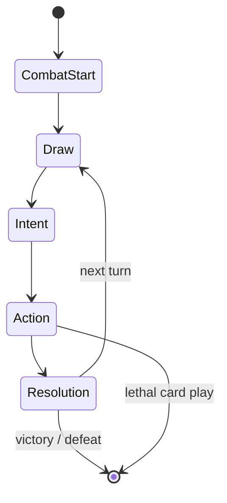

# Topic 3 — Combat

> **Canon.** `§` numbers are an API cited from code and tests — never renumber or delete a section.
>
> **This topic owns:** the shape of a fight — its five phases, the Lead mechanic, the deck, the hand, the consumable pile and the action economy. Everything **you** do on your turn.
> **It does not own:** what the numbers do (Topic 4) or what the enemy does (Topic 5).

---

# §3.1 What a combat is

A combat is an **atomic** event: it starts, it resolves, and it cannot be saved or left in the middle. It has
exactly two outcomes.

| Outcome | Condition |
|---|---|
| **Victory** | Every enemy is defeated — **or**, in a wild encounter, the wild Pokémon is caught (§2.6.4) |
| **Defeat** | All three Active Team Pokémon have fainted |

There is no draw. Both conditions are checked continuously: if a card played during the Action Phase kills the
last enemy, combat ends **immediately** and the enemy's telegraphed action never fires.

## §3.1.1 Ordering when both could happen at once

Inside the Resolution Phase, all damage, status ticks and faints resolve **first**, and only then are the
outcomes checked. If the last enemy and the player's last Pokémon fall in the same Resolution, **Defeat wins** —
the team is gone.

A catch ends combat as a Victory and awards **full** combat XP; it is never an XP penalty compared with a kill.

**Fleeing is not in scope.** A free exit would devalue the swap decision that Pillar 2 is built on.

> ⚠️ **OPEN (2026-09-19).** A *costly* disengage — spending a consumable, or HP, to leave a wild fight — has
> never been explored and might be a good pressure valve. Revisit at v0.2, when wild fights sit inside a real
> run with real HP attrition. Decides: user.

---

# §3.2 The five phases

Each turn cycles through five phases. Every phase emits an event so the UI, audio and relic hooks can react
without the simulation knowing they exist.

## §3.2.1 Combat Start (once)

- The Active Team locks. The **skill deck** is built from each Active Pokémon's active 4 moves — 12 cards
  baseline, up to 15 with Mastery Moves (§5.13.2).
- The **consumable pile** is built from the player's inventory.
- The Lead is the front slot of the Active Team, as ordered in the Map View.
- **Pokémon enter at their current HP.** There is no restoration on entering a fight (§2.4).
- Status conditions and stat stages start clear — they were cleared at the end of the previous combat (§4.2.7).
- Any field effect for this encounter is set, including a boss's Home Field (§4.3.5).

## §3.2.2 Draw Phase

- Draw **5 skill cards** and **2 consumable cards**.
- AP refills to **3**, modified by relics, Badges and Region Modifiers.
- The swap counter resets to 0.
- Confusion discards resolve now (§4.2.3.1).

## §3.2.3 Intent Phase

Each enemy reveals **one** intent. An intent targets a **slot**, not a Pokémon — if it names the bench-left
slot, it hits whoever occupies that slot when Resolution fires.

The display always shows three things: the action type, its magnitude, and the targeted slot **with the name of
its current occupant**. Intent types and their rules: §4.3.2.

## §3.2.4 Action Phase

The player spends 3 AP on any mix of:

- **Skill cards** (0–3 AP; rare 4-AP ultimates exist and need setup to afford).
- **Consumables** (0–2 AP; see §3.5).
- **Manual Lead swaps** (1, then 2, then 3 AP within the turn — §3.3.1).

Card effects resolve **immediately** on play. Hand state is fully visible; hovering or dragging a card previews
its exact calculated damage against the targeted slot, including every multiplier (§4.1.1).

Two restrictions define positional play:

- **Melee cards can only be played from the Lead**, unless the card carries Step-Forward.
- **Ranged cards can be played from any slot**, at 0.75× damage.

Cards are playable only from Pokémon that are in the Active Team and not fainted. The player ends the phase with
**End Turn**.

## §3.2.5 Resolution Phase

In order:

1. Enemies execute their telegraphed intents. With several enemies: supports first in slot order, the lead enemy
   last (§5.6).
2. Position-targeted intents land on whoever **currently** occupies the slot — not whoever was there when the
   intent was declared.
3. Status effects tick (§4.2).
4. Faints resolve (§3.3.5).
5. Outcomes are checked (§3.1.1).
6. The hand goes to the discard pile; used consumables are set aside until combat end; the turn ends.

---

# §3.3 The Lead mechanic

The Lead is the central tactical concept of the game. It answers two questions at once — *who takes the hit* and
*which cards come online* — and changing it always costs something.

## §3.3.1 Core rules

**Damage absorption.** The Lead takes 100 % of single-target enemy damage. The exceptions — Cleave (all slots)
and Backstrike (a named bench slot) — are always telegraphed in the Intent Phase.

**Manual swap cost.** Swapping escalates within a turn:

| Swap this turn | Cost |
|---|---|
| 1st | 1 AP |
| 2nd | 2 AP |
| 3rd | 3 AP |

The counter resets at the start of every turn. **Only manual swaps increment it** — Step-Forward, Step-Backward
and faint replacement do not.

**Defensive swap discount.** A manual swap reduces the AP cost of the **first Defensive-tagged card played after
it that turn** by 1, to a minimum of 0. Manual swaps only; the bundled position changes do not grant it.

**Melee / Ranged interaction.** The Lead determines which Melee cards in hand are playable. Ranged cards ignore
position. This is why a swap is never purely defensive: it also rewrites what your hand can do.

## §3.3.2 Step-Forward (Melee modifier)

- Played from a **bench** Pokémon: that Pokémon becomes the Lead **before** the effect resolves.
- Played from the **Lead**: the effect resolves normally, no position change.
- Does not increment the swap counter. Does not receive the defensive discount.
- Allowed on any role — Offensive, Defensive or Utility.

## §3.3.3 Step-Backward (Melee modifier)

- Played from the **Lead**: the effect resolves **first**, then the Lead swaps with a bench Pokémon of the
  player's choice.
- With no legal bench Pokémon (all fainted or frozen), the effect still resolves and the Lead stays.
- Does not increment the swap counter. Does not receive the defensive discount.
- Allowed on any role.

## §3.3.4 Modifier exclusivity

A card carries **either** Step-Forward **or** Step-Backward, never both. Both are Melee-only: Ranged cards do not
need positional modifiers because they already play from anywhere.

## §3.3.5 Faint resolution

| Who faints | What happens |
|---|---|
| **The Lead** | The player picks any non-fainted bench Pokémon as the new Lead, at **no AP cost** |
| **A bench Pokémon** | It simply leaves. The Lead is unchanged. No prompt |

In both cases the fainted Pokémon's 4 moves — plus its Mastery Move if it has one — are **purged from the skill
deck and the discard pile**. Losing a Pokémon is a deck event, not just a lost body.

### §3.3.5.1 Faint precedence

Faint resolution beats position-restricting status. If a **Frozen** Lead faints in the same Resolution Phase, the
Freeze position-lock is voided and the player picks a new Lead as normal.

## §3.3.6 All-faint

All three Active Team Pokémon fainted ⇒ **Defeat** (§3.1.1 for the tie case).

---

# §3.4 The skill deck

| | |
|---|---|
| **Size** | 12 baseline — 4 active moves × 3 Active Pokémon. Up to 15, one extra per Mastery-unlocked member |
| **Hand** | **5 skill cards per turn**, regardless of deck size |
| **Discard** | Played cards go to the discard pile; when the deck empties, the discard reshuffles into it |
| **Purge** | A fainted Pokémon's cards leave deck and discard immediately (§3.3.5) |
| **Ownership** | A card is playable only while its owner is Active and not fainted |
| **Destruction** | Cards are never permanently destroyed during a combat unless an effect says so |

A deck smaller than the hand is legal and happens early: a run starts with one Pokémon and a two-card deck, and
thickens as you recruit and level (§6.2). Draw what exists; there is no filler card.

---

# §3.5 Consumables

The consumable pile is a **per-combat roster, not ammunition**.

- Built at combat start from the persistent inventory.
- **2 consumable cards drawn per turn**, alongside the 5 skill cards.
- Each consumable can be used **once per combat**; after use it is set aside and not redrawn.
- **At combat end everything returns to the inventory.** Consumables are not expended.
- Duplicates stack as a count; the pile offers distinct entries first, so three Potions never flood the hand.

Two classes are genuinely expendable and sit outside the pile:

- **Pokéballs** — a counted run resource, one spent per throw whether it succeeds or fails (§2.6.4).
- **TMs and Evolution Items** — applied from the Map View, never drawn as cards (§6.4.1, §6.3.2).

The **No Refunds** difficulty modifier (§8.8.2) removes the return-at-combat-end rule, which is precisely why it
is worth ×1.30 Trainer XP.

Consumables upgrade in chains — Potion → Super → Hyper → Max. Full catalogue, AP costs and prices: §7.2 and
[`catalogs/consumables.md`](catalogs/consumables.md).

---

# §3.6 Move taxonomy

Every move is classified on two axes plus optional modifiers. The taxonomy is data, and it is consumed by the
Lead mechanic, the AI and relic effects.

| Axis | Values | Effect on play |
|---|---|---|
| **Role** | Offensive · Defensive · Utility | Defensive cards are eligible for the manual-swap discount (§3.3.1) |
| **Range** | Melee · Ranged | Melee is Lead-only unless Step-Forward; Ranged plays from any slot at ×0.75 damage |
| **Modifier** | Step-Forward · Step-Backward · none | Melee-only, mutually exclusive, no swap-counter increment |
| **Rider** | A status condition with a chance | Shown on the card and in the damage preview (§4.2) |
| **Targeting** | single · cleave · backstrike | Cleave hits every occupied slot; Backstrike names a bench slot |

**Authoring guidelines**

- No mandatory-Ranged rule. Kits are built from species identity and tactical role.
- Ranged moves sit at ~70–80 % of the damage of a Melee move at the same AP, which the ×0.75 range modifier
  delivers automatically.
- Step-Forward and Step-Backward are scarce on base forms and become common as a line evolves — evolution
  upgrades existing moves into positional variants where it fits the species (§6.3).
- Every Pokémon's kit contains at least one Ranged move unless it is explicitly a Lead anchor, or it is dead
  weight whenever it is benched.
- Power sits inside the band for its AP cost — a contract, enforced by a content test (§6.3.6.4).

---

# §3.7 Action economy

| Resource | Base | Refresh | Notes |
|---|---|---|---|
| **AP** | 3 | Each turn | Cap 6. Modified by relics, Badges, Region Modifiers, Paralysis |
| **Skill hand** | 5 | Each turn | Discard-and-reshuffle; Confusion shrinks it |
| **Consumable hand** | 2 | Each turn | Drawn from the per-combat pile |
| **Swap counter** | 0 | Each turn | Manual swaps only |
| **Skill deck** | 12 (→15) | Reshuffles when empty | 4 cards per Active Pokémon, +1 per Mastery |
| **Card cost ceiling** | 3 standard, 4 ultimate | — | Caps single-card dominance |

Three AP against a five-card hand is the core squeeze: most turns you can play two or three things, and a swap
costs one of them.

---

# §3.8 Implementation pointer

The five phases map 1:1 onto the simulation's phase field; the reducer is pure and the RNG cursor lives in the
state, so any turn can be dumped, replayed and diffed (§10.7.4). Current implementation state:
[`implementation-status.md`](implementation-status.md).

---

# §3.9 Consumable catalogue pointer

The 28 consumables — healing, cures, utility, balls, evolution items — with AP costs, prices and upgrade chains:
§7.2 and [`catalogs/consumables.md`](catalogs/consumables.md).

---

# §3.10 Trauma compatibility

Inside a combat, every reference to a Pokémon's maximum HP resolves to **Effective Max HP** (§8.2.1):

- healing consumable and move caps,
- Burn and Poison damage-over-time: `floor(EffectiveMaxHP / 16)`,
- Leftovers regeneration: `floor(EffectiveMaxHP / 16)` (§7.4.4),
- the HP bar's maximum.

Stat-stage modifiers operate on Attack and Defence and are unaffected by Trauma.
