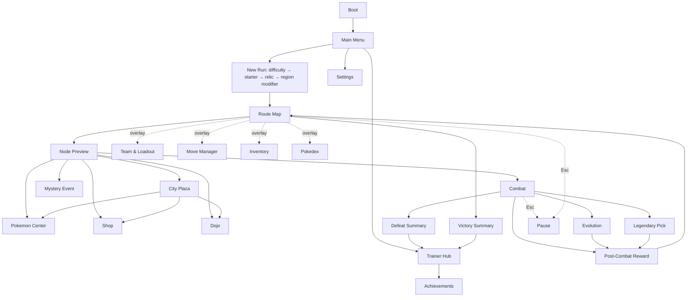

# Topic 9 — Presentation

> **Canon.** `§` numbers are an API cited from code and tests — never renumber or delete a section.
>
> **This topic owns:** the art direction, the colour and type system, the combat and map layouts, iconography, audio, accessibility and the screen inventory.
> **It does not own:** any rule the UI displays. Per-screen detail is in [`ui/screens.md`](ui/screens.md), tokens and components in [`ui/design-system.md`](ui/design-system.md), and rendered references in [`ui/mockups/`](ui/mockups/).

---

# §9.1 Visual style

## §9.1.1 The statement

**Modern illustrated 2D, warm.** Bright, cel-shaded creature-RPG art with depth from lighting rather than
perspective; deckbuilder UI minimalism — Slay the Spire's clarity over decoration.

**Tone.** Cheerful, warm and vibrant by default (Pillar 5). Each Region layers its own palette and lighting on
top without ever breaking the base: even the Volcanic Highlands is *intense and dramatic*, never grim.

**Two coordinated themes.**

| Theme | Where | Feel |
|---|---|---|
| **Warm-light front-end** | Menus, map, node services, management, run-end, meta | Cream surfaces, warm-brown ink — a Pokémon Center interior |
| **Warm-dim stage** | The combat screen only | Deep-plum surface, warm-cream ink — the lights go down for a fight |

Display font **Baloo 2** (rounded), body font **Nunito**. Iconography is a single-weight rounded line set.

## §9.1.2 Asset sizes

| Asset | Size | Notes |
|---|---|---|
| Battle sprite | ~96 × 96, animated | Front and back; scaled up in the stage |
| Portrait | 475 × 475 | Menus, detail panels, card owner avatars at 32 × 32 |
| Box icon | 68 × 56 | Lists and the Box |
| Move card art | 144 × 96 | Landscape, framed by the card chrome |
| Relic icon | 64 × 64 | Rarity-tinted border |
| Held Item icon | 32 × 32 | With an equipped-state overlay |
| Consumable icon | 48 × 48 | 64 × 96 when framed as a card |
| Backdrop | 1920 × 1080 | Calm centre and lower third, so UI sits over it |

## §9.1.3 Colour

### §9.1.3.1 Core tokens

**Warm-light front-end**

| Token | Hex | Use |
|---|---|---|
| `--surface-0` | `#FBF4E6` | Page background, cream |
| `--surface-1` | `#FFFDF8` | Cards, raised tiles |
| `--surface-2` | `#F3E7D0` | Panels, headers |
| `--ink-primary` | `#3A2E22` | Headings and key data, warm brown |
| `--ink-secondary` | `#6B5A45` | Body text |
| `--ink-muted` | `#A8967C` | Labels, disabled |
| `--border` | `#E4D4B5` | Card and panel borders |
| `--accent-action` | `#FFCB3D` | Primary buttons, playable glow, AP pips |
| `--brand-red` | `#E84C4C` | Brand mark, danger accents |
| `--accent-positive` | `#54D98A` | Heals, gains, XP |
| `--accent-negative` | `#FF6B6B` | Damage, costs, faint |
| `--accent-warning` | `#FF9F45` | Status, Trauma, can't-afford |

**Warm-dim stage** overrides two: `--surface-0` `#2A2230` (deep plum) and `--ink-primary` `#FFF6EC` (warm
cream). The accent tokens are shared.

> **A contrast rule that is load-bearing.** On the **warm-light** theme the four semantic accents all fail WCAG
> AA as running text — as low as 1.6:1. They may be used as a **fill** (with dark ink on top), an **icon tint**,
> or a **border, underline or glow** — never as the `color` of text. On the **warm-dim stage** they pass
> comfortably and may be used as text. A "can't afford" warning is therefore an amber left-border and icon with
> normal-coloured text, not amber text.

### §9.1.3.2 Type palette (15)

| Type | Hex | | Type | Hex |
|---|---|---|---|---|
| Normal | `#A8A878` | | Ground | `#E0C068` |
| Fire | `#F08030` | | Flying | `#A890F0` |
| Water | `#6890F0` | | Psychic | `#F85888` |
| Electric | `#F8D030` | | Bug | `#A8B820` |
| Grass | `#78C850` | | Rock | `#B8A038` |
| Ice | `#98D8D8` | | Ghost | `#705898` |
| Fighting | `#C03028` | | Dragon | `#7038F8` |
| Poison | `#A040A0` | | | |

Canonical hues, but rendered warm: even Ice and Water get a warm backing or a warm-tinted glow on the stage so
they sit inside the palette rather than fighting it.

**Colour is never the only channel.** Every type, status and rarity carries a glyph or a shape as well as a
hue — a requirement that exists for colour-blind players and pays off for everyone in a seven-card hand.

---

# §9.2 The combat screen

## §9.2.1 Layout — squad formation

```
┌──────────────────────────────────────────────────────────────────────┐
│ [Region] [Field] [Relics]              [Bag][Team][Dex][Pause]       │  top bar, 60px
├──────────────────────────────────────────────────────────────────────┤
│  ┌────────┐                                                          │
│  │ Bench 1│                                    ╔══════════════╗      │
│  └────────┘        ┌──────────┐                ║              ║      │
│                    │  LEAD ★  │                ║    ENEMY     ║      │
│  ┌────────┐        └──────────┘                ║  (enlarged)  ║      │
│  │ Bench 2│                                    ╚══════════════╝      │
│  └────────┘                                     [intent chip]        │
│   player squad, left                            enemy, right          │
├──────────────────────────────────────────────────────────────────────┤
│ ●●● AP   Deck 8   Discard 3                            [ End Turn ]  │
│ [Card][Card][Card][Card][Card] │ [Cons][Cons]                        │
└──────────────────────────────────────────────────────────────────────┘
```

- **The player squad sits left**: Bench 1 top-left, Bench 2 bottom-left, both the same size, each with a swap
  button showing its current AP cost. The **Lead stands forward to their right**, larger, gold-framed, crowned,
  and never overlapping them.
- **A single enemy is the default**, drawn enlarged and imposing on the right. Two or three use the same squad
  grammar mirrored.
- **The enemy's intent is a chip above it** — icon, magnitude, target label — not an arrow crossing the screen.
- **The catch gauge** (wild only) is a detached pill beside the enemy frame, above its HP bar.
- **The hand tray runs along the bottom**: 5 skill cards, a divider, 2 consumables, AP pips and counters left,
  End Turn right.
- **The damage preview appears next to the targeted Pokémon** when a card is dragged or selected onto it —
  compact, at the point of decision, not in a distant panel.

## §9.2.2 Zones

### §9.2.2.1 Top bar
Persistent and never collapsed: Region modifier badges, the active field badge (with the `🏠 Home Field` marker
when the enemy owns it), up to three relic badges, and the toolbar — Bag, Team, Pokédex, Pause. Each badge shows
its full text on hover or focus.

### §9.2.2.2 Player squad
Each of the three slots shows, in this order: portrait with type badges; the **Lead crown** on the Lead; an HP
bar with a numeric `cur / max` and a cyan shield segment when a shield is present; a status-condition row; a
stat-stage row; a Trauma badge on the portrait corner; and the Lead Aura icon under the Lead when one is active.

The Lead is 1.25× scale with a gold border; the bench sits behind with a neutral border.

A **fainted** Pokémon stays in its slot at reduced opacity with an empty bar. It is never removed from the
screen — the player needs to see the shape of their team.

### §9.2.2.3 Enemy
Portrait with type badges, a Pokédex tier badge, a thicker HP bar (it should feel heavier than yours) with
**phase-threshold notches** for boss-tier enemies, the status and stage rows, and the intent chip above.
A boss adds a faint type-coloured aura glow.

### §9.2.2.4 Hand tray
AP pips (three, a second row up to six, then a `+N` chip), deck and discard counts, the hand itself, and the End
Turn button — which **shifts to gold** when no affordable playable card remains, so "your turn is over" is
visible rather than deduced.

## §9.2.3 The move card

The card is **flooded with its move's type colour**, so a hand reads as a type spread at a glance, while the art
window and the effect text sit in calm cream insets so they stay legible.

Two states: **compressed** at rest, showing only what you need in order to decide — owner avatar, name, range
glyph, AP cost bottom-left, power bottom-right; and **expanded** on hover, focus, selection or drag, unfolding
the art window and effect text **in place**, with neighbouring cards sliding aside rather than the card popping
over the board.

Badges overhang the corners: **top-left the mechanics** (category, range, modifier — gold tint for a positional
modifier), **top-right the status rider** in its condition's colour. Left is how it works, right is what it
inflicts.

**The two ways a card can be unplayable are colour-separated on purpose:**

| State | Treatment |
|---|---|
| **Not enough AP** | Desaturated, an amber border and warning, AP dots showing what you have against what you need |
| **Out of position** (a Melee card whose owner is not the Lead) | **Not** desaturated — you can afford it — but a blue positional lock, `Melee` in bold and `needs Lead slot` beneath |

Amber means AP. Blue means position. Neither card is ever hidden.

Full anatomy: [`ui/design-system.md`](ui/design-system.md).

## §9.2.4 The damage preview

Triggered by hovering or dragging a card onto a target, appearing beside that target. It always shows:

- the **final calculated damage**, large,
- the breakdown — base, STAB, type effectiveness, range, field, relic and item terms,
- the crit chance when it is non-zero,
- the status rider and its chance,
- a redundancy warning ("Already Burned"),
- and a **KO flag** when the hit would finish the target.

This is Pillar 1's single most important element. It calls the same function the simulation calls; a preview
that disagrees with the outcome is a bug, never a rounding difference.

## §9.2.5 Intent vocabulary

| Icon | Intent | Display |
|---|---|---|
| ⚔ | Attack | `⚔ 24 → Lead (Squirtle)` |
| ⚔🌐 | Cleave | `⚔ 18 → ALL SLOTS` |
| 🎯 | Backstrike | `🎯 22 → Bench-L (Charmander)` |
| ⬆ | Buff | `⬆ Atk +1` |
| 🛡 | Stall | `🛡 Def +1` |
| 💢 | Status | `💢 BURN → Lead` |
| ❓ | Unknown | `❓` **plus the kind glyph** — you know a Cleave is coming, not how hard |

The intent number **recomputes live** when the player swaps, because it is predicted against whoever now
occupies the slot. The v0.1 playtest identified this as the element that makes the swap decision legible; it is
not an optimisation, it is the feature.

---

# §9.3 The map screen

```
┌────────────────────────────────────────────────────────────────┐
│ Region 1 — Verdant Route      💰 350₽   ⭐ 240   ◓ 3   🎒      │
├──────────────────────┬─────────────────────────────────────────┤
│  Active Team         │              Map graph                  │
│  [Lead ★] [B] [B]    │      L0  ●                              │
│                      │      L1   ● ● ●                         │
│  Box (drag to swap)  │      L2   ●─●─●                         │
│  ⚪ ⚪ ⚠2 ⚪ …        │      …                                  │
│                      │      L9   ╱────╲   fork                 │
│                      │      L11  👑    👑                      │
├──────────────────────┴─────────────────────────────────────────┤
│ [Inventory] [Pokédex] [Settings]                 [Save & Quit] │
└────────────────────────────────────────────────────────────────┘
```

The graph must read as a **navigable tree, not a tangle**: recessive 2px edges, 40px node circles, the current
position at 1.35× with a pulsing gold ring, reachable nodes in full colour with a white border, locked nodes
desaturated with a dashed border, visited nodes with a checkmark, and the Gym layer scaled up with a gold aura.
Beyond about fifteen visible nodes, distant layers fade to 70 % so the next two or three decisions pop forward.

The left column is the Active Team (three tiles, the Lead crowned) above a scrollable Box. Trauma badges overlay
any portrait; fainted Pokémon are dimmed but still draggable, so you can prepare a post-Center line-up.

---

# §9.4 Iconography

## §9.4.1 Node icons
Wild 🌿 (tinted per biome) · Trainer 👤 · Elite Trainer 👤⭐ · Elite Wild 🦕 · Pokémon Center ❤️ · Shop 🛒 ·
Dojo 📜 · Mystery ❓ · Gym 👑 · City 🏙️.

## §9.4.2 Resource icons
AP ● · Poké Dollar ₽ · Pokéball ◓ · Trainer XP ⭐ · Token 🪙 · Trauma ⚠ · Mastery 🏆.

## §9.4.3 Status icons

| Condition | Icon | Tint |
|---|---|---|
| Burn | 🔥 | Fire |
| Poison | ☠️ | Poison |
| Paralysis | ⚡ | Electric |
| Sleep | 💤 | Desaturated blue |
| Freeze | 🧊 | Ice |
| Confusion | 💫 | Yellow-magenta |

Every one carries a distinct glyph shape, so the row reads in grayscale.

---

# §9.5 Audio

## §9.5.1 Direction
Layered orchestral-electronic, themed per Region. Combat audio is multi-stem so it can follow the fight's
tension; map audio is ambient-forward. Every player action has feedback, every status has a motif, and bosses
get their own track.

## §9.5.2 Combat stems

| Stem | Trigger |
|---|---|
| `combat_base` | Always playing |
| `combat_low_hp` | Team total HP below 30 % |
| `combat_setup` | The first two turns of a boss fight |
| `combat_phase` | Boss Phase 2 or 3 |
| `combat_victory` / `combat_defeat` | Outcome stings |

Stems cross-fade over 250 ms.

## §9.5.3 SFX
Type-coded card whooshes (Fire crackles, Water splashes) · a soft chime for consumables · a confident step plus
chord for a manual swap · directional whooshes for Step-Forward and Step-Backward · a soft fall for a faint ·
type-coded status stings · a crystalline ping for a crit · a heavy layered impact for super-effective · a muted
thud for resisted · paper shuffle for draws · a solid bell for End Turn · rising tension then an orchestral hit
for a boss evolution.

## §9.5.4 Music
Region 1 light flute and strings with birdsong, ~110 BPM major · Region 2 brass, waves and tense strings,
~115 BPM minor · Region 3 percussion, brass and sub-bass, ~125 BPM modal minor · Cities a warm looped rest-hub
jingle · Victory Road sparse cinematic strings, ~85 BPM · each League member a unique track, the Champion a
three-phase dynamic composition.

## §9.5.5 Mix
Master −14 LUFS integrated, music −18, SFX −16 peak. Normalised at authoring time.

---

# §9.6 Accessibility

**Staged, not deferred to nothing.** The full suite was originally a launch requirement, then postponed
wholesale; both extremes were wrong. The two items that are expensive to retrofit come early, the rest follow
at polish.

| Item | Version | Why then |
|---|---|---|
| **Reduced motion** | v0.2 ✅ | Brought forward. Honours `prefers-reduced-motion`: the shake, lunge, deal and pop fallbacks are per-component, and a blanket rule caps *every* animation at one iteration so nothing pulses forever. One-shots keep running, because a `forwards` animation carries its element to a final state and killing it strands damage numbers mid-air |
| **Keyboard play** | v0.2 ✅ | Brought forward. The whole fight runs from the keyboard: 1–9 pick a card, E ends the turn, Escape cancels. Tab order still works; this is the fast path |
| **Screen-reader labelling** | v0.2 ✅ | Brought forward from post-v1.0. Every control carries a name, cards read as a sentence rather than a pile of glyphs, and a polite live region narrates the fight and the map. Asserted by `e2e/a11y.spec.ts`, so it cannot rot |
| **Focus management** | v0.2 ✅ | Every modal takes focus on open, cycles Tab inside itself, and hands focus back on close |
| **Text size** (80 / 100 / 125 / 150 %) | v0.5 | Layouts have to be built at 150 % from the start or they clip |
| Basic settings — audio, fullscreen, language | v0.1 ✅ | Shipped |
| Colour-blind palettes and pattern overlays | v0.9 | The shape-not-just-colour rule (§9.1.3.2) is already enforced, which is the hard half |
| SFX subtitles | v0.9 | Needs the audio pass first |
| Full key and pad rebinding, two profiles | v0.9 | |

The four brought forward were all cheaper to do now than to retrofit, and three of them are the kind of thing
that silently decays the moment nobody is checking. `e2e/a11y.spec.ts` is the check.

**Always true, from v0.1:** every hover has a focus and tap equivalent; nothing unplayable is hidden, only
marked; the damage preview is text as well as colour; pause is available mid-Action-Phase; flashes are capped at
photosensitivity-safe frequencies and disabled entirely under reduced motion.

## §9.6.1 Cognitive accessibility
A tutorial mode with longer telegraphs and slower pacing; an optional hint overlay suggesting a strong play,
off by default and with no penalty for using it; and a Pokédex study mode that previews an enemy's intent pool
against your current team's type matchups.

---

# §9.7 UI architecture

The UI is a **view**: it reads state, dispatches actions and computes nothing but formatting. It never owns
game state and never re-implements a rule — the damage preview calls the simulation, and playability comes from
the simulation as a boolean plus a reason.

Components are state-driven by class, styled from the design tokens of §9.1.3, and structured per screen in
[`ui/design-system.md`](ui/design-system.md). Every display string is localisation-ready with a namespaced
key; no literal English in a component.

> The per-screen specs in `ui/` name their data sources in Unity-era vocabulary — "channels" and "SOs". Read
> those as **store selectors and content lookups**; the binding *shape* is correct even where the noun is not.

---

# §9.8 Mobile

Not a launch target, but kept cheap: hit targets are at least 44 × 44, every hover has a tap equivalent,
tooltips can be tapped open, and layouts reflow from 4:3 to 21:9. A real mobile port is a roadmap item, not a
commitment.

---

# §9.9 Motion

| Element | Motion |
|---|---|
| **Pokémon** | 2-frame idle breath · 4-frame attack lunge · flash and recoil on damage · 3-frame faint fade · an 8-frame evolution sequence |
| **Cards** | Draw slides from the deck (200 ms) · play lifts, glows and fades toward the target (350 ms) · discard fades (150 ms) · the hand fans in |
| **Camera** | Locked in combat; a 1px shake on heavy hits · smooth pan on the map · a 1.5 s zoom and chord for a boss intro |

**The choreography principle:** anything the player must *read in order to decide* — an intent, a damage
preview, a catch gauge — appears **instantly and persistently**. Flourish animates; information does not.

Under reduced motion: bars jump, arrows and previews appear instantly, no parallax, no shake, no particles.
Damage numbers keep a 1.2 s hold and a fade, because persistence is what makes them readable.

---

# §9.10 Localisation

Every user-facing string is a namespaced key (`ui.combat.end_turn`, `move.tackle.name`, `species.pidgey.name`),
never literal text in a component. Layouts tolerate **+40 % string length** and CJK line-breaking without
clipping; buttons hug their content with a minimum width. Numbers, dates and currency go through the formatter.

| Locale | Status |
|---|---|
| English (en-US) | Primary |
| Spanish (es-ES) | Planned for v0.9 |
| French, Japanese | Later; Japanese needs a CJK font |

---

# §9.11 Build order

| Surface | Version |
|---|---|
| Combat screen, scenario picker, main menu | v0.1 ✅ |
| Map, node preview, post-combat reward, team and loadout, starter select, victory, defeat, pause | v0.2 |
| Evolution, Move Manager, TM screen | v0.3 |
| Shop, Mystery Event, inventory | v0.4 |
| Legendary pick, Pokédex, achievements, settings expansion | v0.5–v0.6 |
| City plaza, Dojo, Grand Dojo, Black Market | v0.7 |
| Audio, the accessibility tier, localisation, generated backdrops | v0.9 |

---

# §9.12 The screen inventory

Twenty-seven screens, each with a written spec in [`ui/`](ui/) and a rendered mockup in
[`ui/mockups/`](ui/mockups/). Three are built.

## §9.12.1 Flow



## §9.12.2 Inventory

| Cluster | Screens |
|---|---|
| **Front-end** | Boot · Main Menu · Trainer Hub · Achievements · Settings |
| **New run** | Difficulty · Starter · Starting Relic · Region Modifier |
| **In run** | Route Map · Node Preview · **Combat** · Post-Combat Reward · Evolution · Legendary Pick |
| **Node services** | Pokémon Center · Shop · Dojo · City Plaza · Mystery Event |
| **Management** | Team & Loadout · Move Manager · Inventory · Pokédex |
| **Run end** | Victory · Defeat |
| **Overlay** | Pause · confirmation modal · toast · tooltip |

## §9.12.3 Notable decisions

- **New-run setup is reversible until the first node.** Confirming the Region Modifier locks the seed and
  generates the map, behind an explicit confirmation.
- **Team and loadout are Map-only** and lock on node entry. There is no mid-combat loadout.
- **The City is a top-down aerial town** with clickable buildings. Picking two closes the rest.
- **The Dojo always renders four move slots** plus the locked Mastery fifth; teaching is a choice of which slot
  to fill or overwrite, and Mastery is never a target.
- **Healing previews show before → after** on each team row: solid for current HP, hatched for the restoration.
- **Mystery choices show outcome tags** — gain, cost, risk. Never blind RNG (Pillar 1).
- **Defeat is warm, not punishing.** It shows how far you got and what you kept (Pillar 5).
