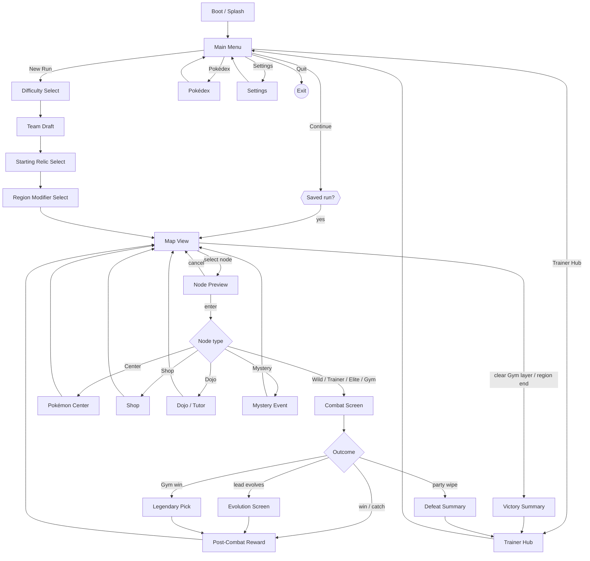
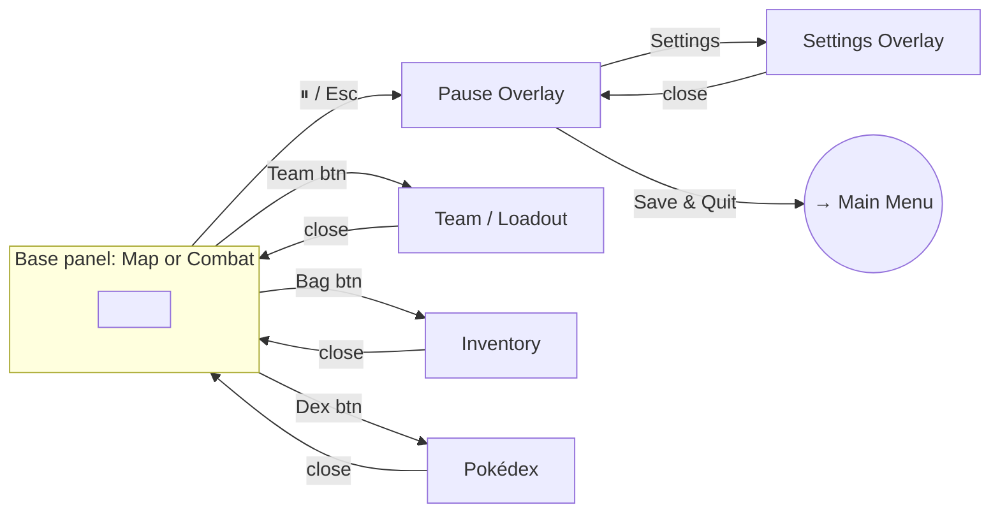

# Screen specifications

> Every screen, in the order the player meets it. **Topic 9 §9.12** holds the inventory and the decisions;
> this file holds the per-screen detail — zones, components, bindings, interactions and states.
>
> Written in the Unity era: where these pages name a "channel" or an "SO", read **store selector** and
> **content lookup**. The binding *shape* is correct even where the noun is not.

---

# Project Ascendant — UI Design Specification (Q23)

> **Status:** WIP draft (design/ — pre-Notion). Owner: producer + ui-programmer + art-director.
> **Purpose:** Define the complete UI of the game so Epic 13 implementation is a *translation*
> job (spec → UXML/USS), not a design job. On user approval this is ratified into GDD **Topic 10**
> as **CL-023** (resolves design question **Q23**) and re-exported.
>
> **Relationship to existing canon:** Topic 10 already specs the combat screen (§9.2), map view
> (§9.3), palette (§9.1.3), iconography (§9.4), audio (§9.5), accessibility (§9.6), UI Toolkit
> architecture (§9.7), animation (§9.9), localization (§9.10). This spec **extends** that, it does
> not contradict it. Where this spec changes an existing §, it is flagged `↻ CHANGE` and routed to
> `game-designer`/`systems-designer` before ratification.
>
> **Relationship to existing code:** every `Assets/Scripts/UI/*PanelUI.cs` today is a **temporary
> uGUI overlay** (gap #38 tech-debt, built imperatively so the Coplay bridge can screenshot it). The
> target below is **UI Toolkit** (§9.7). Epic 13 replaces the temp overlays screen-by-screen; this
> spec is that blueprint. No existing UXML/USS exists yet — this is greenfield in the right framework.

---

## Document set

| File | Covers |
|------|--------|
| `00-overview-and-scene-flow.md` | **(this file)** index, screen inventory, scene-flow architecture, UI router model |
| `01-design-system.md` | Standards: grid, tokens, type scale, component library, icon system, motion, input model |
| `02-combat-and-map.md` | Flagship gameplay screens (extends §9.2 / §9.3) |
| `03-run-flow-screens.md` | Main Menu, New-Run config, Node, Reward, Evolution, Legendary Pick, Victory/Defeat |
| `04-management-screens.md` | Team/Loadout, Inventory, Pokédex, TM/Move Manager, Shop, Center, Dojo |
| `05-meta-screens.md` | Trainer Hub, Achievements, Settings, Pause |
| `06-asset-icon-manifest.md` | Complete art/icon production list (art-director hand-off) |

Each screen spec uses a fixed template (purpose · layout zones · components · data bindings · interactions · states · accessibility), so every entry is implementation-ready and uniform.

---

## Screen inventory (complete)

**Boot & front-end**
1. Boot / Splash
2. Main Menu

**New-Run configuration (the setup before the map)**
3. Difficulty Select
4. Starter Select — single pick from the unlocked Starter pool (§2.1; Box starts with the Starter
   alone, team grows by in-run recruitment — *not* a multi-slot draft)
5. Starting Relic Select
6. Region Modifier Select (R1 pick, per-Region re-pick — CL-016)

**In-run core loop**
7. Map View (extends §9.3)
8. Node Preview / Confirm
9. Combat Screen (extends §9.2)
10. Post-Combat Reward (XP track + loot + catch result)
11. Evolution Screen
12. Legendary Pick (Gym victory — CL-021)

**Management (reachable from Map bottom bar and/or node screens)**
13. Team / Loadout (Active 3 + Box, drag-reorder)
14. Inventory (Relics · Consumables · Held Items)
15. Pokédex
16. TM / Move Manager
17. Shop (node)
18. Pokémon Center (node)
19. Dojo / Tutor (node — CL-009)

**Run end**
20. Victory / Run-Cleared summary
21. Defeat / Run-Over summary

**Meta (front-end, out of run)**
22. Trainer Hub (Trainer Card + PC Terminal kiosks)
23. Achievements
24. Settings (Display & Accessibility · Audio · Controls)

**Cross-cutting overlays (not full screens — components from `01-design-system`)**
25. Pause menu (in-run overlay)
26. Tooltip / hover damage-preview
27. Confirmation modal
28. Toast / notification
29. Loading / scene-transition curtain

---

## Scene-flow architecture

### Decision (to ratify) — Hybrid router model

> `↻ DECISION OD-1` (recommended; user may override at ratification)

The game uses **few Unity scenes + a UI Toolkit panel router**, not one scene per screen.

- **Unity scenes (4):** `Boot`, `FrontEnd` (main menu + hub + settings), `Run` (hosts Map *and*
  Combat — they swap the active root panel, not the scene), `_Persistent` (additive: audio, save,
  event-bus services, the UI router itself — never unloaded).
- **Everything in the Screen Inventory is a UI Toolkit panel** owned by a single **`UIRouter`** that
  manages a **panel stack** (push/pop) and a **layer model** (see `01-design-system DS-7`). Combat,
  Map, Hub are *base panels*; selects/inventory/pause are *pushed overlays*.

**Why hybrid (not scene-per-screen):** matches how the temp UI already layers overlays on
`MapViewUI`; avoids scene-load hitches mid-run; keeps run state resident in memory (no serialize/
deserialize on every menu open); UI Toolkit panels are cheap to show/hide. **Why not single-scene:**
Boot/FrontEnd/Run separation keeps the run's combat assets out of the menu's memory footprint and
gives clean load boundaries for save/resume (§10.8). *Alternative considered:* pure additive
scene-per-screen — rejected for load-hitch + state-marshalling cost.

### Macro flow (front-end → run → end)



### In-run overlay layer (pushed on top of Map or Combat, never replaces them)



---

## Modal vs full-screen classification

| Screen | Presentation | Pushed over | Dismiss |
|--------|-------------|-------------|---------|
| Main Menu, Hub, Map, Combat | **Base panel** (full) | — | route change only |
| Difficulty / Team Draft / Relic / Region-Mod / Legendary Pick | **Full-screen step** (linear, has Back where reversible) | base | Back / Confirm |
| Node Preview | **Anchored popover** (near the node) | Map | Enter / Cancel |
| Reward, Evolution, Victory, Defeat | **Full-screen result** (forward-only, Continue) | base | Continue |
| Team, Inventory, Pokédex, TM/Move, Shop, Center, Dojo | **Full overlay** | base | Close (Esc) |
| Pause | **Dim modal** | base | Resume (Esc) |
| Confirmation, Tooltip, Toast | **Component overlay** | anything | per component |

> **Reversibility rule (Pillar 2 "every decision counts"):** New-Run config steps are reversible with
> **Back** *until* the first node is entered. Once a run-defining choice locks (Region Modifier
> confirmed → map generated from seed), it cannot be re-picked that Region — the confirm uses a
> Confirmation modal. This is a deliberate readability/decision-weight contract, not a tech limit.

---

## Transition language (summary — full motion spec in `01-design-system DS-6`)

| Transition | Motion | Duration | Reduced-motion |
|-----------|--------|----------|----------------|
| Scene change (Boot→FrontEnd→Run) | Curtain wipe | 400 ms | instant cut |
| Base panel swap (Map↔Combat) | Cross-fade + 1.02 scale settle | 300 ms | instant |
| Push overlay (inventory, pause) | Slide-up 24px + fade | 220 ms | fade-only 120 ms |
| Result reveal (reward, evolution) | Staggered element fade-in | 250 ms + 40 ms stagger | all at once |
| Popover (node preview, tooltip) | Fade + 6px rise | 120 ms | fade-only |

---

## Open decisions to ratify (flagged, not assumed)

| ID | Decision | Recommendation | Owner |
|----|----------|----------------|-------|
| OD-1 | Scene/router model | Hybrid (4 scenes + UIRouter panel stack) — above | ui-programmer + unity-specialist |
| OD-2 | New-Run config order | Difficulty → Starter → Relic → Region-Mod | game-designer |
| ~~OD-3~~ | ✅ RESOLVED (§2.1): single **Starter Select**, not a multi-slot draft. Box starts with the Starter alone; team grows via recruitment. | — |
| ~~OD-4~~ | ✅ RESOLVED (§2.3): Team/Loadout is **Map-only**, locked on node entry. No mid-combat loadout; in-combat consumables are the in-hand cards only (§9.2.2.4). | — |
| OD-5 | Settings reachable mid-run via Pause writes only? (Settings load gap #47) | UI assumes working load; flag #47 as blocker for Settings persistence | lead-programmer |

These were resolved during the screen-by-screen pass; the outcomes are canon in Topic 9.

---

# Flagship Gameplay Screens — Combat & Map

> Extends GDD **§9.2** (combat) and **§9.3** (map). Uses the **warm-dim stage** theme (DS-2) and
> the component library (DS-4). Screen-spec template: **purpose · zones · components · bindings ·
> interactions · states · accessibility**. Bindings name event-bus channels / SOs (§9.7) — the UI
> never reads game state directly (`ui.md`).

---

## 2.1 Combat Screen  (base panel · extends §9.2)

**Purpose.** The moment-to-moment battle. Surfaces the whole decision: enemy intent (Pillar 1
telegraphy), the shared hand from the Active Team (5 skill + 2 consumable cards), AP economy, swap
consequences (Pillar 2), and every targeting/damage telegraph needed to plan the turn. The combat
screen is the flagship UI — **readability is the binding contract** (`ui.md` invariants + Pillar 1).

---

### Zones & Master Layout

**`↻ CHANGE to §9.2.1`** — the side-by-side squad formation replaces the old top/bottom stack.

```
┌────────────────────────────────────────────────────────────────────────┐
│  [Region badges] [Field] [Relics]     [Bag][Team][Dex][Pause] (60px)  │ ← Top status bar
├────────────────────────────────────────────────────────────────────────┤
│                    │                                                   │
│   PLAYER SQUAD ←   │      CENTER GAP       →   ENEMY SQUAD             │
│    (LEFT 30%)      │                             (RIGHT 40%)           │
│                    │                                                   │
│   [Bench 1]        │                         [Enemy 1 / Boss]          │
│   [LEAD ★]  ←──────┼──── intent arrows ───→  (scaled large if solo)   │
│   [Bench 2]        │                         [Enemy 2] [Enemy 3]       │
│                    │                           (squad if multi)        │
│                    │                                                   │
│   (layered depth)  │                          (layered depth)          │
│                    │                                                   │
├────────────────────────────────────────────────────────────────────────┤
│  ● ● ● AP  │ Deck: 8  Discard: 3                       [End Turn]     │ ← Bottom tray header
│                                                                        │
│  [Card1] [Card2] [Card3] [Card4] [Card5]  │  [Cons1] [Cons2]          │ ← Hand
│   (skill cards, compressed)               │   (consumables)           │
│                                                                        │
└────────────────────────────────────────────────────────────────────────┘
```

**Reference canvas:** 1920×1080 (DS-1). All panels use flex/anchor percentages for reflow (4:3 → 21:9).

**Zone breakdown:**

1. **Top status bar (60px fixed height)** — persistent badges, always visible, never obscured.
2. **Player squad zone (left 30% width, ~575px)** — the Active Team as a layered formation.
3. **Enemy squad zone (right 40% width, ~768px)** — enemy formation; scales dynamically for 1/2/3.
4. **Center gap (~25% width, ~385px)** — atmospheric backdrop (Region vista from `08` P1-2,
   desaturated 70% + lightness overlay per art-director notes); intent arrows cross this gap.
5. **Bottom hand tray (~340px height)** — hand row (cards) + AP/counters + End Turn button.

**Safe margins:** 48px outer margin on all base panels (DS-1); combat fills the full stage but
keeps the hand tray + status bar within the safe area so UI chrome never clips.

---

### Zone 1 — Top Status Bar (60px)

**Purpose.** Persistent telegraphs for run-wide and combat-specific modifiers; always on-screen,
never hidden or collapsed.

**Layout** (left-to-right, 8px gaps, `--sp-2` inner padding):
- **Left cluster:** Region modifier badges (e.g., "Verdant: Grass +10%") → Field badges (e.g.,
  "Grassy Terrain active") → active Relic badges (up to 3 visible; hover shows full list).
- **Right cluster:** toolbar icon buttons (Bag · Team · Pokédex · Pause), 48×48 each, `--sp-2` gaps.

**Badge anatomy** (shared for Region/Field/Relic):
- 32×32 icon, `--surface-2` backing, `--radius-sm` (8px), 1px `--border-subtle` outline.
- Hover/focus → tooltip with full name + effect text (120ms fade-in, `--sp-3` padding, ≤ 240px wide).
- Rarity-tinted border for Relics (DS-2 rarity tints).

**Toolbar buttons** (icon-only, DS-4):
- **Bag** — opens Inventory overlay (Relics · Consumables · Held tabs) via `UIRouter.Push()`.
- **Team** — opens Active Team panel (portraits + HP + status + reorder) overlay.
- **Pokédex** — opens Pokédex overlay (list view, filters by caught/seen/tier).
- **Pause** — opens Pause modal (Resume · Settings · Save & Quit · Abandon Run).

All four push overlays on the `UIRouter` stack (layer 200); focus traps inside the overlay; Esc/B
pops back to combat. Pause is available **mid-Action-Phase** (§9.6 accessibility mandate).

**Bindings:**
- Region modifiers: `RunStateSO.RegionModifiers` (passive)
- Field effect: `FieldStateChannel` (event-driven, CL-012)
- Relic badges: `RunStateSO.ActiveRelics` (passive list read)

---

### Zone 2 — Player Squad (Left 30%, layered formation)

**Purpose.** Show the Active Team as a **squad** — the Lead is forward + prominent; the two Bench
slots flank and recede, creating depth via **overlap + z-order + scale differential**.

**Formation geometry** (concrete layout for the 3 slots):

| Slot    | Horizontal offset | Vertical offset | Z-order | Scale | Visual cues                  |
|---------|-------------------|-----------------|---------|-------|------------------------------|
| Lead    | center (287px)    | baseline (0)    | 3       | 1.25× | gold crown, forward, largest |
| Bench-L | left (160px)      | +24px behind    | 2       | 1.0×  | slightly overlapped by Lead  |
| Bench-R | right (414px)     | +24px behind    | 1       | 1.0×  | slightly overlapped by Lead  |

**Depth cues:**
- Lead sits **ahead** (z-order 3, no overlap from others, larger scale).
- Bench slots sit **24px higher** (behind in pseudo-3D space) and overlap with Lead at the edges
  (~12px overlap on each side) — the visual language is "squad flanking the leader," not a flat row.
- Lead portrait card has a **4px gold border** (`--accent-action`) + **1.05× scale bump** when
  rendered; Bench slots have a 2px `--border-subtle` neutral border.

**Per-slot HUD anatomy** (identical structure per slot; Lead + Bench differ only in scale/border):

1. **Portrait (96×96 sprite)** — species portrait, centered in a rounded card (`--radius-md`).
2. **Type badge(s)** — 20×20 circle(s) overlaid top-left of portrait; dual-type shows 2 stacked.
3. **Lead crown badge** (Lead only) — 16×16 gold crown icon, top-center overlay (DS-4 crown spec).
4. **HP bar** (below portrait, 110px wide × 8px track):
   - Track: `--surface-0` (warm-dim aubergine).
   - Fill: gradient (green → amber → red by % thresholds: >60% green, 30–60% amber, <30% red).
   - **Phase-threshold notch markers** (boss-tier only, §5.8.3): vertical 2px `--border-strong` line
     at each threshold % (e.g., 70% and 40% for a 3-phase boss) — instant visual telegraph of phase
     transitions. Notches appear only on boss-tier enemies, never on player or standard wilds.
   - **Shield-HP overlay** (CL-022): when `PokemonInstance.ShieldHP > 0`, render a **lighter cyan
     segment** (`#A8E6F0` at 80% opacity) overlaid on the left edge of the fill, width proportional
     to `ShieldHP / MaxHP`. The cyan segment sits **above** the base HP fill (z +1) so it reads as
     a distinct absorb layer. Shield HP is absorbed before real HP; the overlay shrinks as shield
     takes damage. **Numeric display:** `curHP / maxHP` overlaid right-aligned on the bar in
     `--type-number` (tabular); when shield is present, show `curHP+shieldHP / maxHP` with the
     shield portion in cyan text. Example: `45+10 / 60` (shield cyan, HP white).
   - **Minimum legible width:** 80px (smaller viewports may drop the numeric overlay and show
     bar-only; tap/focus reveals a tooltip with full `cur+shield / max`).
5. **Status condition row** (below HP bar, 6px gap):
   - Horizontal row of 20×20 status icons (Burn, Poison, Paralysis, etc., §9.4.3 + DS-5 glyphs).
   - Pattern overlays (stripes/dots, not color-only) for colorblind modes.
   - Max 3 visible icons; if > 3 conditions (rare edge case), show `+N more` text chip (11px caption).
6. **Stat stage row** (below status row, 4px gap):
   - Horizontal row of stat-stage chips (e.g., `Atk +2`, `Def −1`, 18×18 icons + number).
   - Cap at 3 visible; if > 3 stages, show `+N more` chip.
   - Wrap or horizontal scroll if total exceeds portrait width (never clip or hide).
7. **Trauma badge** (top-right overlay on portrait, 20×20 circle):
   - `⚠` glyph on `--accent-warning` fill, 2px dark border (§8.2.5).
   - If Trauma ×2 or higher, show `⚠N` instead of just `⚠`.
8. **Lead Aura indicator** (Lead only, below stat-stage row, 4px gap):
   - 24×24 icon tinted to the Aura's type color (§6.5.4), persistent while Aura is active.
   - Hover/focus reveals tooltip: "Lead Aura: [type] — [effect text]".

**Fainted state:**
- Portrait 60% desaturated + 50% opacity (never hidden, `ui.md`).
- HP bar fill = 0, numeric `0 / max`.
- Status/stage rows cleared (faint clears all conditions per §4.2.7).
- Still occupies the slot; still visible; reorderable in the Box after combat ends.

**Bindings:**
- Portrait sprites: `ActiveTeamChannel.Slot[0/1/2].SpeciesSO → portrait asset`
- HP/ShieldHP/status/stages/Trauma: `ActiveTeamChannel.Slot[N]` struct (event-raised on change)
- Lead index: `LeadChangedChannel` (fires when Lead swaps)
- Lead Aura: `LeadAuraChannel` (event-raised when Aura activates/changes/ends)

---

### Zone 3 — Enemy Squad (Right 40%, dynamic 1/2/3 formation)

**Purpose.** Display the enemy team with the **same squad depth language** as the player side
(when 2 or 3 enemies are present); scale a solo enemy large to convey threat.

**Formation logic:**

| Enemy count | Layout                                          | Notes                                |
|-------------|-------------------------------------------------|--------------------------------------|
| 1 (solo)    | Centered, 1.5× scale (boss-presence)            | Fills the zone; feels heavier        |
| 2           | Side-by-side, equal scale (1.0×), 48px gap      | Flat row; no Lead distinction        |
| 3           | Mirrored player squad (center Lead + 2 flanks)  | Center enemy z-order 3, flanks 2 & 1 |

**Squad geometry (3-enemy case, mirrored):**

| Slot       | Horizontal offset       | Vertical offset | Z-order | Scale | Visual cues           |
|------------|-------------------------|-----------------|---------|-------|-----------------------|
| Enemy Lead | center (right-zone mid) | baseline (0)    | 3       | 1.25× | forward, larger       |
| Flank-L    | left offset (−120px)    | +24px behind    | 2       | 1.0×  | overlapped by Lead    |
| Flank-R    | right offset (+120px)   | +24px behind    | 1       | 1.0×  | overlapped by Lead    |

**Per-enemy HUD anatomy** (extends player HUD with enemy-specific additions):

1. **Portrait (96×96 sprite)** — enemy species portrait, same rendering as player.
2. **Type badge(s)** — 20×20 circle(s) overlaid top-left.
3. **Pokédex tier badge** (wild only, top-right, 20×20):
   - Familiar / Veteran / Master tier icon (§5.8 Pokédex tier system).
   - Unlocks intent detail (Unknown `❓` → revealed per tier).
4. **HP bar** (below portrait, 120px wide × **10px track**, thicker than player for visual weight):
   - Same gradient fill + phase-threshold notches (boss-tier only).
   - **Boss-tier aura glow** (boss only): 12px blur, type-color at 15% opacity, subtle pulsing (1.5s
     ease-in-out loop; static in reduced-motion).
   - Numeric `cur / max` right-aligned, `--type-number`.
5. **Catch gauge** (wild Pokémon only, CL-014, **above HP bar, 6px gap**):
   - 0–100 fill bar, 120px wide × 6px track, `--surface-0` track.
   - Fill color: `--ink-muted` (neutral gray) at gauge < 100; shifts to `--accent-positive` (green)
     **when gauge = 100** (catch-ready telegraph).
   - **Numeric %** overlaid right-aligned (tabular): "Catchability: N%".
   - Appears **only on wild Pokémon**; hidden for Trainer battles.
   - Positioned **above the HP bar** (not below, not overlaid) — the catch decision is read-priority
     when it appears, so it sits higher in the visual hierarchy.
6. **Status / stat-stage rows** — identical to player HUD (below HP bar, same 6px/4px gaps).
7. **Intent display** (above enemy portrait, 32px gap):
   - Intent chip (icon + magnitude + target slot) per §9.2.5 vocabulary.
   - Arrow crosses the center gap and lands in the target slot (player side).
   - Multi-target intents (Cleave) show a **sweeping bracket** or multiple arrows (bracket preferred;
     less clutter). The bracket is a 3px `--accent-negative` arc spanning all 3 player slots.

**Enemy visual weight (art-director notes):**
- Enemy portraits sit on a **−5% lightness inset** (`--surface-1` darkened) to feel heavier.
- Enemy HP bars are **10px track** (vs 8px player) for stronger presence.
- Boss-tier gets a faint **type-color aura glow** (12px blur, 15% opacity).

**Bindings:**
- Enemy sprites/HP/status: `EnemyStateChannel` (event-raised struct per enemy slot)
- Intent: `IntentRevealedChannel` (§5.8, fires at Intent Phase start)
- Pokédex tier: `PokedexTierSO` (passive read per species)
- Catch gauge: `CatchGaugeChannel` → `WildCatchResolver.Catchability(hpPercent, hasStatus, ball)` (pure function, CL-014)

---

### Zone 4 — Center Gap (atmospheric backdrop)

**Purpose.** Spatial separation between player and enemy squads; intent arrows cross this gap.

**Visual treatment:**
- Region-1 vista backdrop (1920×1080 sprite from `08` P1-2), heavily desaturated (70%) + lightness
  overlay (+15%) so it reads as **atmospheric, not busy** (art-director spec).
- **Optional scrim** (if backdrop is too detailed): 40% opacity `--scrim` rectangle just behind the
  node markers/graph area to create separation (backdrop visibility is an art-director tuning call).
- Region tinting applied (Verdant = warm green-slate, Coastal = warm teal-slate, Volcanic = warm
  ember-slate, all warm per §9.1.1 / §9.1.1).

**Intent arrow rendering:**
- Arrows are **3px thick**, drop-shadow for readability against any background.
- Color-coded by intent type:
  - `--accent-negative` (coral red) for Attack/Cleave/Backstrike.
  - `--accent-warning` (amber) for status/debuff intents.
  - `--ink-muted` (gray) for Stall/self-buff (non-threatening).
- Arrow **terminates directly in/on the target slot** (player side) with a subtle 2px pulsing
  outline (1.2s ease-in-out loop) on the target slot in the same color.
- **Unknown intent (`❓`, CL-011)** renders as a dashed gray arrow; tooltip on hover/focus: "Unrevealed — raise Pokédex tier to see this intent."

**Bindings:** backdrop sprite is passive (loaded from `RunStateSO.RegionIndex`).

---

### Zone 5 — Bottom Hand Tray (~340px height)

**Purpose.** Display the hand (5 skill + 2 consumable cards), AP economy, deck/discard state, and
the End Turn button. Cards are **dragged to targets** or click-selected then click-target; the
**damage preview appears on drag-over-target** (final calculated value, §9.2.4 / §9.7 / `09`).

**Layout** (top-to-bottom, then left-to-right):

1. **Tray header row (48px height, full width):**
   - **AP pips** (left, 96px cluster):
     - 3 base pips (`--accent-action` lit / `--ink-muted` dim), pill-shaped (`--radius-pill`),
       14×14px each, 4px gaps.
     - Animate spend with soft 180ms shrink-fade.
     - **AP > 3 (rare buff state):** add a second row underneath (max 6 pips on-screen). If AP > 6,
       show `+N` text badge (12px caption, gold) next to the pips instead of more visual pips.
   - **Deck / Discard counts** (center-left, 160px cluster):
     - `Deck: N` · `Discard: M` in `--type-small`, `--ink-secondary`.
   - **End Turn button** (right, 140px × 40px):
     - `--primary` variant (DS-4 buttons), label "End Turn" (loc key `ui.combat.end_turn`).
     - **Gold shift** when no affordable playable card remains (§9.2.2.4): border + text shift to
       `--accent-action` to signal "your turn is done; confirm to proceed."
     - Keyboard: Space / Y (gamepad).

2. **Hand row (cards, 260px height, full width):**
   - **Skill cards (5, left cluster):** compressed state by default (110px wide × 196px tall, per
     `09` locked anatomy). 8px gaps between cards.
   - **Consumable cards (2, right cluster):** rounded silhouette (per `09`), 110px wide × 196px tall.
   - **Separator (optional, art-director call):** 2px `--border-subtle` vertical line between skill
     and consumable clusters (16px gap total). If added, keep it subtle — the rounded silhouette
     contrast is already strong.
   - **Density check (7 cards at 110px + gaps):** 7 × 110 + 6 × 8 = 770 + 48 = 818px. Fits within
     1920px with ample margin. Safe.

**Card interaction states (per `09` locked anatomy):**

| State                | Trigger                                        | Treatment (verbatim from `09`)                                                                                   |
|----------------------|------------------------------------------------|------------------------------------------------------------------------------------------------------------------|
| Compressed (default) | resting, affordable, playable                  | Full colour, crisp; shows owner avatar + name + AP + power + range icon (always visible)                        |
| Expanded             | hover / focus / select / drag                  | Unfolds art window + effect text; grows in place within the hand row (neighbouring cards slide aside)           |
| Not enough AP        | `MoveSO.ApCost > currentAP`                    | Desaturated (grayscale + 50% opacity) · AP dots gold-have vs red-missing · amber `⚠` next to dots + amber border · **stays fully visible** |
| Out of position      | Melee card AND owner is NOT Lead AND no Step-Forward | **Not desaturated** (it's affordable) · blue positional lock overlay + melee glyph + `Melee` 18px bold + `needs Lead slot` 11px semibold subtitle · blue = position |
| Drag-over-target     | dragged onto an enemy/ally slot                | **Damage preview** appears (layer 500): final value + STAB/type/crit breakdown + rider + redundancy warning (§9.2.4 / §9.7) |

**Melee playability rule (§3.3.1 / §3.3.6, load-bearing):**
- Melee cards are playable **only from the Lead slot**, UNLESS the card carries Step-Forward (which
  swaps the bench Pokémon into Lead before resolving).
- Ranged cards are playable from any position (no restriction).
- The "Out of position" state triggers when: `card.Range == Melee AND card.OwnerInstance.SlotIndex != LeadIndex AND !card.HasModifier(StepForward)`.
- UI reads `IsPlayable(card, state) → (bool, reason enum)`; it does NOT compute the rule directly.

**Damage preview (drag-over-target only, no persistent dock):**
- Tooltip layer (500), 120ms fade-in, `--surface-2`, `--radius-md`, `--sp-3` padding, ≤ 320px wide.
- **Always shows:** final calculated damage value (large, `--type-number`), breakdown line (Base ×
  STAB × Type × …), crit chance % (if non-zero), status rider details (condition + % chance),
  redundancy warning (e.g., "Already Burned" if re-applying).
- **Triggered by:** dragging a skill card over an enemy slot; the preview updates live as the drag
  moves between targets (instant recalc per target).
- **No persistent dock** (`09` §7 accessibility note): the §9.6 "always-on damage preview"
  accessibility toggle is **dropped in this iteration** (master-designer decision 2026-06-14). Flag
  for accessibility review at ratification — a lightweight "sticky preview" option may be re-added
  if needed, but the current design is hover/drag-only.

**Swap cost ladder telegraph (Pillar 2, §3.3.1 load-bearing):**
- Manual Lead swap costs scale: **1st = 1 AP, 2nd = 2 AP, 3rd = 3 AP** within a turn; counter resets
  at turn start. Step-Forward / Step-Backward do NOT increment this counter.
- **Visual telegraph (DECIDED — concrete spec):**
  - When hovering/dragging a Bench portrait onto the Lead slot (manual swap preview), show a small
    **cost chip** overlaid on the Bench portrait: `Swap: N AP` (11px caption, gold text on
    `--surface-2` backing, `--radius-sm`).
  - The chip shows the **current swap cost** based on the swap counter (read from
    `SwapCounterChannel`): 1st swap in turn shows `Swap: 1 AP`, 2nd shows `Swap: 2 AP`, etc.
  - The chip appears **only during hover/drag** (instant on hover-start, 80ms fade-out on hover-end).
  - **Keyboard/pad:** when a Bench slot is focused and the player presses the Swap action key (S /
    Select), the chip appears and remains visible until focus moves or the swap is committed.
- **Insufficient AP:** if `currentAP < swapCost`, the chip shows `Swap: N AP` in **amber + ⚠**
  (same treatment as unaffordable cards); the swap is blocked.
- **Post-swap reset:** the counter resets at turn start (no UI telegraph needed; the cost ladder
  re-starts at 1 AP on the next turn).

**Bindings:**
- Hand (cards): `HandChannel` → `CardInstance[]` (event-raised on draw/play/discard)
- AP pips: `APChannel` → `currentAP, maxAP` (event-raised on spend/gain)
- Deck/Discard counts: `DeckCountChannel` → `deckCount, discardCount`
- Damage preview: `DamageCalculator.Preview(card, target) → DamageBreakdown` (pure function, §9.7)
- Swap cost: `SwapCounterChannel` → `currentSwapCount` (event-raised on manual swap; resets at turn start)
- Playability: `HandChannel.CardState[i] → (isPlayable, reason)` (event-raised per card on state change)

---

### Interactions (complete input model)

**Play a card:**
1. **Mouse/touch:** drag card onto target slot → damage preview appears on drag-over → drop to commit.
   - OR: click card (selects) → click target slot → commit.
2. **Keyboard:** number key 1–7 selects card in hand → arrow keys select target slot → Enter commits.
3. **Gamepad:** d-pad/stick navigates hand → A selects card → d-pad/stick selects target → A commits.

**Manual Lead swap:**
1. **Mouse/touch:** drag Bench portrait onto Lead slot → swap cost chip appears → drop to commit.
   - OR: select Bench portrait → click "Swap" action button → confirm modal → commit.
2. **Keyboard:** Tab to Bench slot → S (Swap key, rebindable) → confirm → commit.
3. **Gamepad:** d-pad to Bench slot → X (Swap button, rebindable) → confirm → commit.

**End Turn:**
1. **Mouse/touch:** click End Turn button.
2. **Keyboard:** Space (primary) / Enter (alt).
3. **Gamepad:** Y (primary) / Start (alt).

**Catch (wild only, when gauge = 100):**
- Pokéball consumable card becomes playable (drag onto wild → commit).
- Catch gauge shifts to `--accent-positive` green to signal ready.

**Inspect (tooltip / hover detail):**
- **Mouse:** hover any badge/icon/intent → tooltip appears (120ms fade).
- **Keyboard:** focus + hold (500ms dwell) → tooltip.
- **Gamepad:** focus + hold Right Trigger → tooltip.

**Pause (mid-Action-Phase, §9.6):**
- Esc / B / Start → Pause modal (layer 300, `--scrim`, focus trap).

---

### States (edge cases & special moments)

| State                      | Trigger                                   | UI treatment                                                                                                     |
|----------------------------|-------------------------------------------|------------------------------------------------------------------------------------------------------------------|
| **Targeting**              | Card selected, awaiting target           | Valid target slots: 3px dashed `--accent-action` outline, 120ms pulse. Invalid slots: 60% desaturated, no highlight. |
| **Unaffordable card**      | `card.ApCost > currentAP`                 | Card: grayscale + 50% opacity, amber `⚠` + border, **stays fully visible** (`ui.md`). Label: "Not enough AP".   |
| **Out of position (melee)**| Melee card, owner not Lead, no SF         | Card: **not desaturated** (affordable), blue lock overlay + `Melee` 18px bold + `needs Lead slot` 11px subtitle. |
| **Frozen/asleep Lead**     | Lead has Sleep/Freeze condition           | Lead portrait: 80% desaturated overlay + condition icon enlarged (32×32, pulsing). Cards from Lead: unplayable (per §4.2.2.4 / §4.2.2.5). Faint precedence (§3.3.5.1): if Lead faints same turn, Freeze lock voided. |
| **Boss Phase 2/3**         | Boss HP crosses phase-threshold notch     | Signature-phase banner (300ms slide-in from top, 2s hold, fade-out): "Phase 2!" + boss name. Audio layer swap: `combat_signature_phase_layer` crossfades in (250ms ramp). |
| **Resume-into-combat**     | Load save mid-combat (CL-022)             | Rebuild full UI state from `RunStateDTO` (no animation replay). HP bars fill instantly. Intent arrows appear instantly (no fly-in). Resume banner (1s): "Resuming combat…". |
| **Empty hand**             | All cards played/discarded, AP remaining  | End Turn button pulses gold (1.2s ease-in-out loop). Tooltip: "No cards left — end turn to draw." (accessibility). |
| **No AP left**             | `currentAP = 0`, unplayed cards remain    | End Turn button pulses gold. Tooltip: "Out of AP — end turn to continue."                                       |
| **Catch ready (wild)**     | Wild Pokémon, gauge = 100                 | Catch gauge fill shifts to `--accent-positive` green. Pokéball consumable (if in hand) highlights gold (playable cue). Tooltip on gauge: "CATCH READY — use Poké Ball." |
| **Multi-target (Cleave)**  | Enemy intent = Cleave(N)                  | Sweeping bracket (3px `--accent-negative` arc) spans all 3 player slots. Tooltip: "⚔ N dmg → ALL SLOTS".       |
| **Unknown intent (`❓`)**  | Intent unrevealed (low Pokédex tier)      | Dashed gray arrow, `❓` chip. Tooltip: "Unrevealed — raise Pokédex tier to see this intent." (CL-011).          |

---

### Accessibility (§9.6 compliance + `ui.md` invariants)

1. **Colorblind modes (§9.6):**
   - Type/status icons carry **glyph + pattern** (stripes/dots), not color-only.
   - Intent arrows: color + icon (⚔/🎯/⬆/🛡/💢) dual-encode meaning.
2. **Text size (§9.6):**
   - All text elements scale 80/100/125/150% via Settings.
   - Layout designed at 150% to avoid clipping; buttons hug content with min-width.
3. **Reduced motion (§9.6):**
   - HP bar fills: instant jump to new value (no fill animation).
   - Intent arrows: always visible, no fly-in (appear instantly at Intent Phase start).
   - Damage numbers: appear instantly above target, hold 1.2s, fade 300ms (only allowed motion;
     persistence needed for readability).
   - Status application: 2-frame white border pulse (80ms × 2, PEAT-safe) to signal "new condition."
   - Card animations: instant state changes (no expand slide, no shrink-fade on spend).
4. **Damage preview always-on dock (§9.6):**
   - **DROPPED in this iteration** (`09` §7 note). The hover/drag-only model is the current spec.
   - **Flag for accessibility review:** if a lightweight "sticky preview" toggle is needed (e.g., a
     small docked panel showing the last-hovered card's damage breakdown), it can be added post-VS.
5. **Keyboard/pad full parity (no hover-only):**
   - Card selection: number keys 1–7 / d-pad.
   - Target selection: arrow keys / d-pad.
   - Swap: S key / X button (rebindable).
   - End Turn: Space / Y.
   - Inspect: hold-focus (500ms dwell) / Right Trigger.
   - Pause: Esc / B / Start (available mid-Action-Phase).
6. **Focus ring (always visible, DS-2):**
   - 3px `--accent-action` rounded outline, offset 2px, on every focusable element.
7. **Grayed-not-hidden (`ui.md` invariant):**
   - Unaffordable / out-of-position cards: desaturated/overlaid, **never removed from hand**.
   - Disabled UI elements: 50% opacity, no pointer, `--ink-muted`, **still visible**.
8. **Boss HP phase markers (`ui.md` invariant):**
   - Vertical 2px `--border-strong` notch at each phase threshold on boss HP bars.
9. **Intent shows slot + occupant (`ui.md` invariant):**
   - Intent display: `⚔ N → Lead (Squirtle)` — slot label + current occupant name.
10. **Subtitles for audio cues (§9.6):**
    - Optional text feedback for SFX-only signals (e.g., "Crit!", "Super effective!") in a small
      toast (bottom-left, 1s hold, fade).

---

### Open Combat Flags — Resolved + Remaining

**RESOLVED (concrete decisions in this spec):**

1. **Shield-HP overlay visual (CL-022):**
   - **DECIDED:** Lighter cyan segment (`#A8E6F0` at 80% opacity) overlaid on HP bar fill, width
     proportional to `ShieldHP / MaxHP`. Sits above base HP fill (z +1). Numeric display:
     `curHP+shieldHP / maxHP` with shield portion in cyan text. Example: `45+10 / 60`.
   - **No further sign-off needed** — this is the implementation spec.

2. **Catch-gauge telegraph position (CL-014):**
   - **DECIDED:** Positioned **above the wild's HP bar, 6px gap**, same 120px width. Fill color
     neutral gray at gauge < 100; shifts to `--accent-positive` green when gauge = 100 (catch-ready).
   - **No further sign-off needed** — this is the implementation spec.

3. **Swap cost-ladder visual (§3.3.1):**
   - **DECIDED:** Cost chip (`Swap: N AP`, 11px caption, gold on `--surface-2`, `--radius-sm`)
     overlaid on Bench portrait during hover/drag. Shows current swap cost (1/2/3 AP based on
     `SwapCounterChannel.currentSwapCount`). Appears only during hover/drag (instant on, 80ms fade out).
   - **No further sign-off needed** — this is the implementation spec.

4. **Damage-preview drag treatment (§9.2.4 / `09`):**
   - **DECIDED:** Hover/drag-over-target only; no persistent dock. Tooltip layer 500, final value +
     breakdown + crit% + rider + redundancy. The §9.6 "always-on dock" toggle is **dropped** in
     iteration 1 (flagged for accessibility review at ratification; may re-add a lightweight sticky
     option post-VS if needed).
   - **No further sign-off needed** — this is the implementation spec.

5. **Toolbar placement (Bag/Team/Dex/Pause):**
   - **DECIDED:** Top status bar, right cluster, 48×48 icon buttons, `--sp-2` gaps. All push
     overlays via `UIRouter` (layer 200). Pause available mid-Action-Phase.
   - **No further sign-off needed** — this is the implementation spec.

6. **Melee-usable-only-from-Lead rule (`09` flag, §3.3.1 / §3.3.6):**
   - **DECIDED (verified from GDD):** Melee cards are playable **only from Lead slot**, UNLESS the
     card has Step-Forward modifier (which swaps bench → Lead before resolving). Ranged cards
     playable from any position. Out-of-position state: blue lock overlay + `Melee` 18px bold +
     `needs Lead slot` 11px subtitle (per `09` iteration-2 refinement).
   - **No further sign-off needed** — this matches §3.3.1 / §3.3.6 exactly.

7. **AP-overflow +N visual (DS-4 AP pips):**
   - **DECIDED:** 3 base pips; if AP > 3, add second row (max 6 pips on-screen). If AP > 6, show
     `+N` text badge (12px caption, gold) next to the pips instead of rendering more pips.
   - **Needs systems-designer confirmation:** Does any content grant > 6 AP? (Rare buff state; if
     it exists, the `+N` spec is ready; if not, cap at 6 and no badge needed.)
   - **Action:** Query `systems-designer` at ratification.

**REMAINING FLAGS (need game-/systems-designer sign-off at ratification):**

None — all combat flags are either resolved with concrete specs above, or deferred to
post-iteration-1 (accessibility dock toggle, AP > 6 confirmation).

---

### GDD §9.2 Master Layout Change Summary (`↻ CHANGE` items)

**§9.2.1 Master Layout:**
- **OLD:** Top/bottom stack (enemy top 40%, player mid 30%, hand bottom).
- **NEW:** Side-by-side (player LEFT 30%, enemy RIGHT 40%, hand bottom). Center gap for atmospheric
  backdrop + intent arrow crossing. Squad formations (layered depth: Lead forward + larger, Bench
  behind/flanking) replace flat rows.
- **Rationale:** Intent arrows crossing the center gap create a clearer spatial telegraph (Pillar 1).
  The squad depth language (overlap + scale + z-order) conveys "team formation" vs "card slots."
- **Action at ratification:** User/art-director/game-designer approve the side-by-side geometry +
  squad layering before Epic 13 implementation begins. This is a **load-bearing layout change** and
  the most visible revision to §10.2.

---

### Data Bindings Summary (complete event-bus map)

| UI element                      | Channel / source                                                           |
|---------------------------------|----------------------------------------------------------------------------|
| Enemy sprite/intent/HP/status   | `EnemyStateChannel`, `IntentRevealedChannel` (§5.8)                        |
| Enemy Pokédex tier badge        | `PokedexTierSO` (passive read per species)                                 |
| Catch gauge (wild)              | `CatchGaugeChannel` → `WildCatchResolver.Catchability(hp%, status, ball)`  |
| Player Active Team portraits    | `ActiveTeamChannel.Slot[0/1/2]` (event-raised on change)                   |
| Lead index / crown              | `LeadChangedChannel` (event-raised on swap)                                |
| HP / ShieldHP                   | `ActiveTeamChannel.Slot[N].HP / .ShieldHP`                                 |
| Status conditions               | `ActiveTeamChannel.Slot[N].StatusConditions[]`                             |
| Stat stages                     | `ActiveTeamChannel.Slot[N].StatModifiers{}`                                |
| Trauma badge                    | `TraumaChannel` → `PokemonInstance.TraumaCount` (§8.2.5)                   |
| Lead Aura                       | `LeadAuraChannel` (event-raised on activate/change/end)                    |
| Hand (skill + consumable cards) | `HandChannel` → `CardInstance[]` (event-raised on draw/play/discard)       |
| AP pips                         | `APChannel` → `currentAP, maxAP`                                           |
| Deck / Discard counts           | `DeckCountChannel` → `deckCount, discardCount`                             |
| Swap cost                       | `SwapCounterChannel` → `currentSwapCount` (resets at turn start)           |
| Damage preview (drag)           | `DamageCalculator.Preview(card, target) → DamageBreakdown` (pure, §9.7) |
| Region modifiers / Field        | `RunStateSO.RegionModifiers`, `FieldStateChannel` (CL-012)                 |
| Active Relics                   | `RunStateSO.ActiveRelics`                                                  |

UI **never** queries logic systems directly — all bindings are event-driven or pure function calls (`ui.md`).

---

**Acceptance checklist (DS-9):**
- ✅ Uses only tokens from DS-1–DS-3 (no ad-hoc px/hex).
- ✅ Composes only DS-4 components (HP bar, AP pips, skill/consumable cards, badges, tooltips, buttons).
- ✅ States every component's data binding as event-bus channel / SO.
- ✅ Lists empty/loading/disabled/focus states (see States table).
- ✅ Has reduced-motion notes (instant HP fills, no screen-shake, instant intent/preview).
- ✅ Has full keyboard + pad navigation (see Interactions + Accessibility).
- ✅ Names loc-key namespaces (e.g., `ui.combat.end_turn`, `combat.card.*`).
- ✅ Cites GDD § (§3.3.1 swap cost, §3.3.5 faint precedence, §4.2.2 status, §5.8 intent, §6.5.4 Aura, §9.2).
- ✅ Passes Pillar-5 readability skim (warm-dim theme, cheerful motion, friendly type colors).
- ✅ Passes `ui.md` invariants (damage preview final value, grayed-not-hidden, intent slot+occupant, boss HP phase markers).

---

## 2.2 Map View  (base panel · extends §9.3)

**Purpose.** Between-combat navigation + the **only** place to change the Active Team/Box loadout
(§2.3, locked on node entry). Shows the branching Region graph, current position, the team, the Box,
and utility access. Layout already canon in §10.3.

**Zones.** Top bar (Region name + ₽ / ⭐ XP / 🎒) · Left column (Active Team + reorderable Box) ·
Right (branching map graph, layered, current node highlighted, future node-type icons §9.4.1) ·
Bottom utility bar (Inventory · Pokédex · Settings · Save & Quit).

**Components.** `Pokémon card/portrait tile` · `drag-and-drop list` (Box) · `node marker` (per §9.4.1
icons, biome-tinted wild) · `HP bar` (mini) · `Trauma badge` · `icon button` · `confirm modal`.

**Data bindings.**
| UI element | Channel / source |
|-----------|------------------|
| Region name / biome tint / layer | `RunStateSO`, `MapGenerationConfigSO` |
| Map graph nodes + edges + current pos | `MapGraphChannel`, `NodeVisitedChannel` |
| Active Team + Box (order, HP, Trauma, level) | `BoxChannel`, `ActiveTeamChannel`, `TraumaChannel` |
| Currency / XP / inventory counts | `RunEconomyChannel`, `MetaProgressionSO` |

**Interactions.** Click a **reachable** node → Node Preview popover (§3.x). Drag Box↔Active to
reorder/swap; **Confirm** commits the loadout (Pillar 2 weight; §2.3) — unreachable while a node is
entered. Lead is the front Active slot, gold-crowned. Bottom bar opens overlays (Inventory/Pokédex/
Settings) via UIRouter push. Save & Quit → confirm modal → autosave (§10.8) → Main Menu.

**States.** *Reachable vs locked nodes* (locked = dimmed, not hidden) · *Current node* (pulse ring) ·
*Trauma'd Box member* (⚠ badge, can still be fielded) · *Loadout dirty* (Confirm button highlights) ·
*Gym layer* (👑 layer visually emphasized as the Region climax) · *Resume* (CL-022: map re-derived by
MapRNG replay — must render identically).

**Accessibility.** Box drag has keyboard equivalent (focus + `[ ]` to move, DS-4 drag spec) ·
node markers carry shape+label not color-only · reduced-motion: instant pan, no pulse · every node
marker is focusable and announces "type + reachable/locked" · loadout Confirm reversible until node
entry (matches §2.3 + the reversibility rule in `00`).

---

## Art-director visual-hierarchy notes (Map View)

### Node-graph spatial clarity
The branching map graph must read as a **navigable tree**, not a tangle. Visual requirements:
- **Edges** (connections between nodes) = 2px `--border-subtle` lines, subtle and recessive.
- **Nodes** = 40×40px circles (or 44×44 if hit-target compliance demands it; add 2px transparent padding).
- **Current position** = 54×54px (1.35× scale), pulsing gold ring (2px `--accent-action`, 1.5s ease-in-out
  loop; static in reduced-motion).
- **Reachable nodes** = full-color icon + white border (2px).
- **Locked/future nodes** = 50% desaturated icon + dashed border (1.5px `--border-subtle`).
- **Visited nodes** = checkmark overlay (12×12px white ✓ on a 60% opacity dark circle, bottom-right corner).
- **Gym/Boss node (layer climax)** = 1.2× scale + gold aura glow (8px `--accent-action` at 20% opacity).

If the graph has > 15 nodes visible at once (deep layer), consider a subtle **depth-fade**: nodes further
from the current layer are 70% opacity, so the local decision (next 2–3 nodes) pops forward.

### Active Team + Box layout (left column)
The left column shows the Active Team (3 slots) + the Box (scrollable list). Vertical space is tight.
**Hierarchy:**
- **Active Team** occupies the top ~180px (3 × 56px portrait cards + 12px gaps).
- The **Lead** slot is visually distinct: +4px gold border, 1.05× scale, and the crown badge (DS-4).
- **Box list** fills the remaining vertical space (~600px at 1080p). Each Box row is 48px (portrait 40×40
  + 4px padding). Scrollable via scrollbar (8px wide, `--surface-3` track, `--accent-action` thumb).
- **Trauma badge** overlays the top-right of any portrait (Active or Box). It's a 20×20px circle with
  `⚠` glyph, `--accent-warning` fill, 2px dark border. If a Pokémon has Trauma ×2, show `⚠2` instead.
- **Fainted** Pokémon in the Box are 60% desaturated + 50% opacity, but NOT hidden (they're still
  drag-reorderable so you can prep your post-Center lineup).

### Box drag-and-drop visual feedback
When dragging a Box portrait onto an Active slot (or reordering within the Box):
- **Lifted card** = 1.08× scale, 6px drop-shadow, `--surface-3` backing.
- **Valid drop target** = 3px dashed `--accent-action` outline, 120ms pulse.
- **Invalid drop target** = no highlight (stays neutral).
- **Snap-back animation** (if dropped on invalid area) = 250ms ease-out spring back to origin.

Keyboard reorder (`[ ]` keys): show the focused card with a 3px `--accent-action` solid ring + a small
floating "⬆⬇ reorder" hint (12px caption text, appears on focus, fades on blur).

### Map-graph backdrop visibility
The map backdrop (Region-1 vista, `08` P1-2) sits behind the graph. It should be **atmospheric, not
busy** — a soft-focus or heavily desaturated scene (70% desaturation, +15% lightness overlay). The node
markers and edges must read clearly against it. If the backdrop is too detailed, add a 40% opacity
`--scrim` rectangle behind the graph canvas (just the graph area, not the whole screen) to create separation.

---

## Cross-screen notes

- Combat and Map are the two **base panels** of the `Run` scene; the UIRouter `Replace()`s between
  them with a 300ms warm cross-fade (instant in reduced-motion).
- Both host the same bottom/utility affordances styled per theme; the **toolbar icon set** (Bag,
  Team, Dex, Settings, Pause, Map) is shared and lives in the asset manifest (`06`).
- Region tinting of `--surface-0/1` (DS-2) is applied at the stage level so both screens inherit the
  Region's warmth automatically.

---

## Art-director visual-hierarchy notes (Combat Screen)

### Intent arrow clarity (P0 — blocks telegraphed-tactics pillar)
The side-by-side layout puts enemy intents on the RIGHT and player slots on the LEFT. **Intent arrows
must cross the center gap and terminate directly in/on the target slot.** Visual requirements:
- Arrow color = `--accent-negative` (damage intents) or `--accent-warning` (status/debuff intents) or
  `--ink-muted` (stall/self-buff).
- Arrow thickness 3px, with a subtle drop-shadow so it reads against any background.
- The target slot gets a thin pulsing outline in the same color (2px, 1.2s ease-in-out loop).
- Multi-target intents (Cleave) show a sweeping bracket or multiple arrows; the bracket is preferred
  (less visual clutter).
- Unknown intent (`❓`) shows a dashed gray arrow with a tooltip on hover/focus: "Unrevealed — raise
  Pokédex tier to see this intent."

### Enemy vs player visual weight
The enemy formation is the **threat** — it should feel visually heavier/larger than the player team even
when sprite sizes are identical. Techniques:
- Enemy portraits sit on a subtly darker `--surface` inset (−5% lightness from base).
- Enemy HP bars are thicker (10px track vs 8px for player).
- Boss-tier enemies get a faint aura glow (their type color at 15% opacity, 12px blur).
- Player portraits feel lighter/closer via a +3% lightness lift on their background cards.

### Status/stage icon row legibility
Status icons (Burn, Poison, etc.) and stat-stage icons (Atk +1, Def −2) sit below HP bars. When a
Pokémon has both, the rows can collide. **Stacking rule:**
- Status conditions = top row (always visible, never hidden).
- Stat stages = second row, capped at 3 visible icons; if > 3 stages, show `+2 more` text chip.
- If total row height exceeds the portrait's vertical space, stat stages wrap or scroll horizontally
  (never clip or hide status conditions).


> **Move-card anatomy revised 2026-09-19.** The owner's portrait *is* the art window, with the move's type as
> a chip in its corner and the owner's name on a ribbon along the bottom. The previous layout put a 22 px
> avatar beside the title and gave the art window to a type glyph, which meant a twelve-card shared hand gave
> no way to tell whose card was whose at a glance — the one thing a shared hand has to communicate (Pillar 3).

### Hand tray card density
At 7 cards (5 skills + 2 consumables, worst case), the hand tray must fit without horizontal scroll at
1920px width. Layout math:
- 7 cards × 110px compressed width = 770px.
- Gaps: 6 × 8px = 48px.
- Total: ~820px. Safe margin.
- If consumables and skills are visually separated by a subtle divider (2px `--border-subtle` vertical
  line), add 16px. Still safe.
- **Do not** add a consumable-section background tint — the rounded cream silhouette is enough contrast.
  A tint will break the warm stage backdrop harmony.

### Reduced-motion combat readability check
When animations are disabled:
- HP bar fills = instant jump to new value (no fill animation).
- Intent arrows = always visible, no fly-in (they appear when intents are revealed, per the combat phase).
- Damage numbers = appear instantly above the target, hold 1.2s, fade out over 300ms (this is the only
  allowed motion in reduced-mode for damage — the persistence is needed for readability).
- Status-condition application = icon appears instantly in the status row, with a 2-frame flash (white
  border pulse, 80ms × 2) — this is PEAT-safe and conveys "new condition" without motion.

---

# Run-Flow Screens — Front-end, New-Run Setup, Node, Results

> Warm-light theme (DS-2) for front-end/setup; warm-dim stage for in-run results. Template:
> **purpose · zones · components · bindings · interactions · states · accessibility.** New strings
> are named by loc-key namespace, never literal English (DS-8).

---

## 3.1 Boot / Splash  (transient)

**Purpose.** Studio/fan-disclaimer card → load `_Persistent` services + `MetaProgressionSO` → Main
Menu. **Components.** logo lockup, `loading curtain`. **Bindings.** save-load readiness from
`SaveSystem`. **Interactions.** any-key skip after logo. **States.** loading / save-corrupt (→ toast
+ safe Main Menu). **Accessibility.** fan-disclaimer text honors text-size; no flashing logo
(photosensitivity §9.6).

---

## 3.2 Main Menu  (base panel · FrontEnd scene)

**Purpose.** Front door. Routes to Continue / New Run / Trainer Hub / Pokédex / Settings / Quit.
**Zones.** Title lockup (Poké-Ball-red brand mark, `--brand-red`) · vertical button stack (centered/
left) · build-version + save-status footer · warm illustrated backdrop (Region-1 vista, parallax —
off in reduced-motion). **Components.** `button --primary` (New Run), `button --secondary` (rest),
`Continue` shows a **run-summary chip** (Region, team portraits, depth) when a save exists.
**Bindings.** `SaveSystem.HasResumableRun`, `RunStateDTO` summary, `MetaProgressionSO` (Trainer Lv on
a small card). **Interactions.** Continue (disabled-but-visible when no save) → resumes (§10.8); New
Run → Difficulty Select; others push overlays/panels. **States.** no-save (Continue disabled, not
hidden) · save present (Continue primary, New Run warns "abandons current run?" via confirm modal).
**Accessibility.** full kbd/pad vertical nav, focus ring; backdrop is decorative (`aria-hidden`).
**Loc:** `ui.menu.*`.

---

## 3.3 New-Run setup (linear, reversible until first node) — `↻ DECISION OD-2` order

Difficulty → Starter → Starting Relic → Region Modifier. A shared **stepper chrome** (progress dots
top, `◀ Back` / `Continue ▶` bottom) wraps all four; Back is allowed within setup; the final
**Region-Modifier Confirm** locks the run (seed → map gen) behind a confirm modal.

> **Mockups + refinements (user-iterated 2026-06-17 — `mockups/newrun-1..4-*.html`):**
> - **3.3a** each difficulty card shows **both** its challenge **Modifier** (gray) **and** its **Trainer-XP
>   Reward** (green multiplier) — risk and reward read together; recommended tier carries a brand outline.
> - **3.3b** uses the **real Pokémon portrait** (not a placeholder icon); the **type icon sits top-left
>   inside the roster tile**, but in the **detail panel the type is a labelled chip beside the name**
>   (off the photo). Stats render as labelled bars (the §3.3b "stat radial" text-equivalent). Real art per
>   the mockup-art doctrine (`06`): portraits `Assets/Sprites/VS/Portraits/`, type icons `…/UI/Icons/Type/`.
> - **3.3c** the relic grid is **scrollable** (detail + footer fixed) so any pool size fits; canon offer is a
>   curated **1-of-3** (§8.6.3 / Task 12.11). Rarity by border **and** label (not colour-only).
> - **3.3d** shows the **curated 3-offer** (§2.11.3, weighted to team) with tier badges + the **run-lock confirm
>   modal** ("map is generated from the seed now; can't re-pick until the next Region").

### 3.3a Difficulty Select
**Purpose.** Choose difficulty (`DifficultyModifierSO`). **Components.** 2–4 `option cards` (one
recommended, 2px brand outline), each: name, one-line effect, modifiers list. **Bindings.**
`DifficultyCatalog`, unlock state from `MetaProgressionSO`. **Interactions.** pick → Continue.
**States.** locked tiers (shown, lock glyph + "unlock at Trainer Lv N"). **Accessibility.** effect
text not color-only. **Loc:** `ui.newrun.difficulty.*`.

### 3.3b Starter Select  (resolves OD-3 — single pick, §2.1)
**Purpose.** Pick one Starter from the unlocked pool (Bulbasaur/Charmander/Squirtle + meta unlocks).
**Zones.** Starter roster (portrait tiles) · detail panel (type, base stats radial, the 2 starting
moves per CL-006, evolution line preview, flavor). **Components.** `Pokémon card tile`, `type badge`,
`stat radial`, `move chip`. **Bindings.** `StarterCatalog` (unlocked subset via `MetaProgressionSO`),
`PokemonSpeciesSO`, `LearnsetSO`. **Interactions.** select tile → detail updates → Continue.
**States.** locked Starters (silhouette + unlock hint, not hidden) · selected (brand edge).
**Accessibility.** roster is a focusable grid; stat radial has a text-equivalent table.
**Loc:** `species.*`, `ui.newrun.starter.*`.

### 3.3c Starting Relic Select
**Purpose.** Pick the opening relic (replaces the temp `StartingRelicPanelUI`). **Components.**
`relic card` grid with **rarity-tinted borders** (DS-2), detail on focus. **Bindings.**
`StartingRelicPool`, `RelicSO`. **Interactions.** 1-of-N pick → Continue. **States.** hover/focus
shows full effect + source; selected = brand edge. **Accessibility.** rarity encoded by border +
label, not color-only. **Loc:** `relic.*`.

### 3.3d Region Modifier Select  (CL-016; per-Region re-pick)
**Purpose.** Choose the Region's single active modifier from the 16-pool (CL-016); re-chosen each
Region. **The Confirm here LOCKS the run/seed** → map generates. **Components.** `modifier card`
grid (1 active), confirm modal. **Bindings.** `RegionModifierResolver`, `RegionModifierCatalog`,
seeds `RunStateSO`. **Interactions.** pick → **Confirm (modal: "Lock in {Modifier}? The map is set
for this Region.")** → Map View. **States.** Naturalist's Lens (CL-018) shows its biome-steer preview.
**Accessibility.** confirm modal Esc=cancel; modifier effects are full text. **Loc:** `regionmod.*`.

---

## 3.4 Node Preview  (anchored popover · over Map)

**Purpose.** Confirm entering a node; preview what's inside before locking the team (Pillar 2).
**Zones.** Popover anchored to the node marker: type icon + name, short preview (Wild: biome +
possible species silhouettes + Pokédex tier; Trainer/Elite/Gym: archetype hint + reward; Center/Shop/
Dojo/Mystery: one-line). **Components.** `popover`, `type/node badge`, `reward chip`. **Bindings.**
`NodeSO`, `EncounterPreviewChannel`, reward tables. **Interactions.** `Enter` (routes per node type,
§00 flow) / `Cancel`. **States.** team-not-ready warning (e.g. all-fainted Box) · first-visit vs
known. **Accessibility.** popover traps focus, Esc=Cancel, Enter=Enter. **Loc:** `node.*`.

---

## 3.5 Post-Combat Reward  (full-screen result · forward-only)

**Purpose.** Resolve victory: XP to team + Box (CL-010 100%/75%), loot, catch result, Trainer-XP/
Battle-Pass progress (CL-019). **Zones.** header ("Victory!" / "Caught {species}!") · XP panel (per-
Pokémon bars filling, level-up & evolution-eligible flags) · loot row (₽, relics, consumables, TMs) ·
Trainer-Level track delta (milestone ticks, CL-019) · `Continue`. **Components.** `XP bar`, `Trainer-
Level bar` (segmented), `relic/consumable/loot card`, `toast` (achievement unlocked, CL-020).
**Bindings.** `CombatResultChannel`, `XPAwarder`, `RunEconomyChannel`, `BattlePassChannel`,
`AchievementService`. **Interactions.** staggered reveal (skippable, §9.6) → Continue → Evolution
(if eligible) or Map. **States.** catch-success branch (adds caught Pokémon to Box) · level-up (badge)
· evolution-eligible (routes to 3.6) · Battle-Pass milestone (token toast). **Accessibility.** Skip-
animations honored; bars fill instant in reduced-motion; everything has text labels. **Loc:**
`ui.reward.*`.

> **Art-director note:** The XP-bar fill animation is the *reward* moment — it should feel satisfying,
> not rushed. 400ms ease-out per bar (staggered 80ms between team members), with a soft gold particle
> burst (3–5 particles, 16px sprites, `--accent-action`, 300ms rise+fade) when a bar completes. In
> reduced-motion mode: instant fill, 2-frame flash (white border pulse, 100ms × 2), no particles. The
> Battle-Pass milestone tick should "ding" (visually: a 1.15× scale pulse + gold glow, 200ms) and play
> the achievement-unlock toast if a Token reward is reached.

---

## 3.6 Evolution Screen  (full-screen result · §9.9 evo anim) — ✅ v0.3

**Purpose.** Play the evolution moment and apply the CL-007 evolution payload (free archetype move,
stat shift). **Zones.** centered evolving Pokémon (8-frame anim §9.9) · before→after name/type/
stat diff · new-move/archetype callout (CL-007). **Components.** `Pokémon portrait`, `stat-diff
rows`, `move chip`, `Confirm`. **Bindings.** `EvolutionChannel`, `PokemonInstance`, `LearnsetSO`.
**Interactions.** play anim → reveal diff → (if a move choice is offered) pick → Confirm. **States.**
cancel-evolution option if the design allows holding (verify §6.3); reduced-motion = instant
before/after, no flash (photosensitivity). **Accessibility.** the screen-flash on complete (§9.5.3)
is capped/PEAT-safe and disabled in reduced-motion. **Loc:** `ui.evolution.*`, `species.*`.

> **Art-director note:** The evolution animation (§9.9, 8-frame sequence) is the **one place** the
> game goes full celebratory. The before→after stat diff and new-move callout should feel like **level-up
> rewards in a JRPG**: big numbers, warm gold accents, a subtle rising-sparkle background (opt-out in
> reduced-motion). The screen-flash at the end is a white full-screen overlay at 60% opacity, held for
> 80ms, then 180ms fade-out — PEAT-verified safe, but **completely disabled** in reduced-motion mode
> (just cuts to the "after" portrait, no flash). Do not let the celebration undercut Pillar 5 warmth —
> the flash should feel like a *camera flash*, not a lightning strike.

> **As shipped (v0.3).** Built, with two deviations. The morph is a 700 ms cross-fade that bleaches the
> "before" out rather than an 8-frame sequence; §9.9's sprite animation waits on the frames. And there is **no
> screen-flash at any setting** — the safe version is a real piece of work (PEAT verification, a held white
> overlay, an opt-out path) and a missing flourish is better than an unsafe one, so it is a v0.9 item rather
> than a half-built effect. Reduced motion skips the morph entirely and opens on the "after".
>
> The rest is as specified: the archetype cards show the payload as a before→after diff with the upgrades that
> will land in your active 4 marked, the stat diff is a delta column, and Confirm is gated on a pick. There is
> no cancel: §6.3.1 was reconciled with §6.2.2 and evolution is not deferrable — only the branch is a choice.

---

## 3.7 Legendary Pick  (full-screen step · CL-021, Gym victory)

**Purpose.** 1-of-3 Legendary relic choice on Gym victory / Summit / Black-Market (CL-021), max
2/run. Replaces temp `LegendaryPickSelectUI`. **Zones.** three `relic card`s with the **Legendary
gold shimmer** rarity treatment (DS-2; static in reduced-motion) · "max 2 per run" counter · Confirm.
**Bindings.** `LegendaryRelicCatalog`, `RunStateSO` (held count, seeded per-Region). **Interactions.**
focus → full effect; pick one → confirm. **States.** at-cap (screen explains; offers skip/alt reward
per CL-021) · already-held dimmed. **Accessibility.** shimmer is decorative; rarity also via label.
**Loc:** `relic.legendary.*`.

---

## 3.8 Victory / Run-Cleared Summary  (full-screen result)

**Purpose.** Celebrate clearing the Region/Gym climax (VS end-state); roll meta rewards. **Zones.**
banner · run stats (depth, turns, catches, badges) · Trainer-XP/Token earned · unlocked achievements
· `Continue → Trainer Hub`. **Components.** `metric tiles`, `achievement toast list`, `button`.
**Bindings.** `RunResultChannel`, `MetaProgressionSO`, `AchievementService`. **Interactions.**
Continue → Hub. **Accessibility.** all stats text; celebratory motion off in reduced-motion. **Loc:**
`ui.victory.*`.

---

## 3.9 Defeat / Run-Over Summary  (full-screen result)

**Purpose.** Party-wipe end (§run loss). Honest, warm-not-punishing tone (Pillar 5). **Zones.**
"Run over" · how far you got · meta rewards still earned (Trainer-XP/Tokens from the run, CL-019) ·
a single encouraging line · `Continue → Trainer Hub`. **Components.** same as 3.8 minus celebration.
**Bindings.** `RunResultChannel`, `MetaProgressionSO`. **Interactions.** Continue → Hub.
**Accessibility.** no harsh red flash; warm amber framing. **Loc:** `ui.defeat.*`.

---

## Shared run-flow rules

- All **setup** screens (3.3a–d) share one stepper chrome + Back/Continue; all **result** screens
  (3.5–3.9) share one forward-only result chrome (header · body · Continue) so the player learns one
  pattern.
- Result screens never trap the player: Continue is always reachable by keyboard/pad.
- `↻ flag` 3.6 "cancel evolution" and 3.7 "at-cap behavior" need a `game-designer` confirm against
  §6.3 / CL-021 before ratification.

---

# Management Screens — Team, Inventory, Pokédex, Moves, Node Services

> Warm-light theme (DS-2), component library (DS-4). Template: **purpose · zones · components ·
> bindings · interactions · states · accessibility.** Team/Inventory/Pokédex open as **overlays**
> from the Map bottom bar (Map-only for Team, per OD-4); Shop/Center/Dojo are **node screens**.

---

## 4.1 Team / Loadout  (full overlay · Map-only, §2.3)

**Purpose.** Compose the Active Team of 3 from the Box and reorder it (the Lead is the front slot).
This is the central tension screen (a Box member contributes nothing to the deck — §2.3).
**Zones.** Active Team strip (3 slots, Lead front + crowned) · Box grid (all owned Pokémon) ·
detail panel (selected Pokémon: types, level/XP, stats, current moves, ability, Held Item, Trauma) ·
**Confirm** loadout bar. **Components.** `Pokémon card tile`, `drag-and-drop`, `stat radial`, `move
chip`, `held-item chip`, `Trauma badge`, `confirm button`. **Bindings.** `BoxChannel`,
`ActiveTeamChannel`, `PokemonInstance`, `TraumaChannel`. **Interactions.** drag Box↔Active to set the
3 + order; pick Lead; **Confirm** commits (Pillar 2). Unreachable once a node is entered (loadout
locked). **States.** dirty (Confirm highlights) · invalid (<1 healthy → warn) · Trauma'd member
(fieldable, badge) · full Box scroll. **Accessibility.** keyboard reorder (`[ ]`), each tile
announces name/level/HP/Trauma; stat radial has text table. **Loc:** `ui.team.*`, `species.*`.

---

## 4.2 Inventory  (full overlay · tabbed)

**Purpose.** Review/manage everything the run is carrying. **Zones.** segmented tabs **Relics ·
Consumables · Held Items** · content grid · detail panel. **Components.** `tabs`, `relic card`
(rarity border), `consumable card`, `held-item row`, detail panel. **Bindings.** `RunInventoryChannel`,
`RelicSO` / `ConsumableSO` / `HeldItemSO`, `RunStateSO` (Legendary count badge). **Interactions.**
*Relics* read-only (passive, show source + effect; Legendary flagged) · *Consumables* show count, used
in combat as hand cards (here read-only in VS, or "discard" if design allows) · *Held Items*
**equip/unequip onto a Box Pokémon** (drag onto a team tile or pick from a list). **States.** empty
tab (empty-state line) · equipped vs unequipped held items · relic cap indicators. **Accessibility.**
tabs are arrow-navigable, rarity by border+label, equip has keyboard path. **Loc:** `item.*`.

> `↻ flag` Whether consumables are discardable from Inventory and whether Held-Item swapping is
> mid-run unrestricted → confirm with `game-designer` against §8 before ratification.

---

## 4.3 Pokédex  (full overlay · reachable from Map, Hub, Main Menu)

**Purpose.** The persistent knowledge artifact (CL-001 rename Bestiary→Pokédex; §8.9). Drives the
"study the enemy" loop (Pillar 1): tiers reveal intents. **Zones.** filter/search bar (type, tier,
seen/caught) · species list (`list rows`: portrait, name, types, tier badge Familiar/Veteran/Master) ·
detail panel (sprite, types, base stats, **known intent pool by tier**, evolution line, catch/seen
counts, flavor). **Components.** `tabs/filter chips`, `list row`, `tier badge`, `stat radial`, `intent
chip` list. **Bindings.** `PokedexSO` / `bestiary.dat` (CL-022), `PokemonSpeciesSO`, `IntentPoolSO`,
tier thresholds (§8.9 / CL-011). **Interactions.** filter/search; select → detail; tier governs how
much intent detail is shown (locked entries show `???` + "battle/​catch to reveal"). **States.**
unseen (silhouette) · seen-not-caught · caught · tier progression bar per species. **Accessibility.**
list is a focusable column; `???` reveal rule explained in text; stat radial text-equivalent. **Loc:**
`species.*`, `ui.pokedex.*`.

---

## 4.4 TM / Move Manager  (full overlay · from Map or Dojo) — ✅ v0.3

**Purpose.** Teach TMs and manage a Pokémon's move list within the move-kit construction rules
(§6.3.6) and CL-006 level-gated learnset. Merges temp `TMPanelUI` + `MoveManagerUI`. **Zones.** target
Pokémon selector (Box) · its current moves (up to the kit cap) · available pool (TMs owned + level-up
moves learnable now) · move detail (type, power, AP, tags, riders). **Components.** `Pokémon
selector`, `move chip`/`move card`, `TM card`, swap/replace control. **Bindings.** `MoveManagerService`,
`LearnsetSO`, `TMInventoryChannel`, kit-rules from §6.3.6. **Interactions.** teach a TM/level-up move
→ if at cap, choose a move to replace (clear before/after diff); respects archetype/kit constraints
(CL-007). **States.** at-cap (must replace) · illegal teach (blocked + reason) · no-target. 
**Accessibility.** before/after diff is text; replace is keyboard-drivable. **Loc:** `move.*`.

> `↻ flag` Exact move-kit cap and which moves are legal to replace come from §6.3.4/§6.3.6 — bind to
> the data, don't hardcode; `content-designer` confirms edge rules. **Resolved in v0.3:** the cap is 4, read
> from the sim, and *any* pool move is legal in any slot — the only illegal states are an empty kit and a
> fifth card, both refused by `validateKit`.

> **As shipped (v0.3).** One deviation, and it is the interesting one: **at the cap a new move is not a
> replace prompt, it is locked.** The spec assumed teaching at the cap should ask which card to drop; in play
> that turns every level-up into a modal, and the pool is supposed to be a *reward*, not a bill. So a move
> past the fourth simply joins the pool, the Reward screen names it, the Box row carries a badge with how many
> are waiting, and the player swaps when they feel like it. Everything else is as specified, including the
> greyed-not-hidden incompatible TM. The `Auto` button applies the §6.3.6 kit rules in one click.
>
> Reachable from any Box row on the Map, and embedded in the Dojo beside the shelf so the consequence of a
> purchase is on screen while you decide. Esc closes the overlay before it closes the pause menu.

---

## 4.5 Shop  (node screen · §7 Shop)

**Purpose.** Spend ₽ on relics/consumables/Held Items/TMs; the CL-015 City "Black Market" variant
sells Legendaries. **Zones.** header (₽ balance) · stock grid (`cards` with price tags) · detail/buy
panel · optional "sell/services" area (if §7 allows) · Leave. **Components.** `item card` (rarity
border), `price chip`, `buy button`, `confirm` for big spends. **Bindings.** `ShopStockChannel`
(seeded), `RunEconomyChannel`, item SOs. **Interactions.** select → buy (deduct ₽, toast) → stock
greys out; Leave → Map. **States.** can't-afford (price red, buy disabled-visible) · sold-out (greyed)
· Black-Market Legendary (gold treatment + max-2 rule, CL-021). **Accessibility.** prices are text;
buy has keyboard path; affordability not color-only (add "can't afford" label). **Loc:** `ui.shop.*`.

---

## 4.6 Pokémon Center  (node screen · §7 Center)

**Purpose.** Heal/recovery hub — the warmest screen, sets the Pillar-5 tone. Heals HP, may reduce
Trauma per §8.2 / §7 rules. **Zones.** warm Center interior · team row with HP/Trauma before→after ·
service buttons (Heal, Trauma care if applicable) · Leave. **Components.** `Pokémon row`, `HP bar`,
`Trauma badge`, `service button`, `confirm`. **Bindings.** `HealService`, `ActiveTeamChannel`/`BoxChannel`,
`TraumaChannel`, costs from `EconomyConfigSO`. **Interactions.** choose service → animated heal (bars
rise) → Leave. **States.** already-full (service disabled) · cost-gated (if any) · Trauma-care
availability (per design). **Accessibility.** heal bars instant in reduced-motion; chime has subtitle
option (§9.6). **Loc:** `ui.center.*`.

> `↻ flag` Whether the Center reduces Trauma (and at what cost) is a §8.2/§7 design point — confirm
> with `game-designer`; UI supports both (show the service only if enabled).

---

## 4.7 Dojo / Tutor  (node screen · CL-009) — ✅ v0.3

**Purpose.** Paid move/ability tutoring (CL-009 standalone Dojo). **Zones.** tutor framing · target
Pokémon · teachable moves/abilities with ₽ costs · before/after · Leave. **Components.** reuses the
**TM/Move Manager** body (4.4) plus a price layer + an ability-teach row (CL-008 earned-learner).
**Bindings.** `DojoServiceChannel`, `LearnsetSO`, `AbilityCatalog`, `RunEconomyChannel`. **Interactions.**
pick service → pay → teach (kit rules apply) → Leave. **States.** can't-afford · at-cap (replace) ·
ability already known. **Accessibility.** same as 4.4 + price text. **Loc:** `ui.dojo.*`.

> **As shipped (v0.3).** Built on the node-screen chrome, in the warm front-end theme like the Centre (4.6)
> rather than the stage theme — a service stop is not a fight. Three columns: the Box on the left, the two
> services in the middle, the live deck (4.4 embedded) on the right.
>
> "Can't afford" is **"no services left"** until the economy lands: a visit carries one service instead of a
> purse (§2.9.4's v0.3 substitution), and spending it greys every other row at once, which turns out to read
> more clearly than a price would. An ability whose hook has not shipped says "no effect until a later
> version" on its own row rather than being sold as working.

---

## Shared management rules

- Team/Inventory/Pokédex share one **overlay chrome** (title bar + Close ✕, Esc closes, focus
  trapped) pushed by the UIRouter over Map.
- Shop/Center/Dojo share one **node-screen chrome** (header + content + Leave→Map) so node services
  feel consistent.
- Every "buy/teach/equip" mutation goes through a service channel and emits a `toast` confirmation;
  the UI never mutates `RunStateSO` directly (`ui.md`).

---

# Meta & System Screens — Trainer Hub, Achievements, Settings, Pause

> Warm-light theme (DS-2). Template: **purpose · zones · components · bindings · interactions ·
> states · accessibility.** These sit in the **FrontEnd** scene (Hub/Achievements/Settings) or as an
> in-run overlay (Pause). All read the persisted `MetaProgressionSO` (view-only) — no run state.

---

## 5.1 Trainer Hub  (base panel · FrontEnd · §8.4)

**Purpose.** Between-run home: review your trainer identity and the meta you've earned. A clean **2D
warm kiosk menu**, not a 3D scene (§8.4). Replaces the temp `HubPanelUI`. VS ships two live kiosks —
**Trainer Card** and **PC Terminal** — plus greyed post-launch kiosks (Daycare, Mystery Door).
**Zones.** title · two kiosk cards side-by-side · post-launch greyed kiosks row · `Back`. **Components.**
`kiosk card`, `Trainer-Level bar` (segmented, milestone ticks CL-019), `metric tiles`, `button`.
**Bindings.** `MetaProgressionSO` (Trainer Level/XP/Tokens, runs won/lost), `MetaProgressionConfigSO`
(`CumulativeXPForLevel`), `AchievementService` (count). **Interactions.** Trainer Card = view stats;
PC Terminal → Achievements (5.2) and Pokédex (4.3); greyed kiosks show "Post-launch". Back → Main
Menu. **States.** level-up-available glow on the track · Token balance highlight · empty history
("Epic 13" → real run-history list, now in scope). **Accessibility.** kiosks are focusable; track has
a numeric readout; greyed kiosks are visible+labeled, not hidden. **Loc:** `ui.hub.*`.

> The temp Hub also hosts the **Token-spend / Mastery-relic lane** (CL-019 Tier-3) and **meta-starter
> unlocks** — add these as a third "Trainer Shop" kiosk (Tokens → permanent unlocks). `↻ flag` confirm
> the Token-spend catalog with `game-designer`/`systems-designer` (CL-019 §8.6).

---

## 5.2 Achievements  (full overlay · §8.7 / CL-020)

**Purpose.** Browse the 50-entry medal-tier catalog (CL-020). **Zones.** header (count + total) ·
category filter chips (8 categories) · medal-tier filter (Bronze/Silver/Gold/Platinum) · achievement
`list rows` (medal icon, name or `??? (hidden)` for hidden+incomplete §8.7.3, description, status: ✓
+reward / `prog/target` / locked) · summary of Tokens earned. **Components.** `filter chips`, `list
row`, `medal badge` ×4 tiers, `progress text`. **Bindings.** `AchievementCatalog`, `AchievementService`
(`IsCompleted`, `GetProgress`), `MetaProgressionSO`. **Interactions.** filter; rows are read-only;
completed rows celebrate (warm green). **States.** hidden+incomplete (`???`) · in-progress (counter) ·
complete (medal + reward). **Accessibility.** medal tier shown by icon+label not color-only; list
focusable; hidden-reveal rule in text. **Loc:** `achievement.*`.

---

## 5.3 Settings  (full overlay · reachable from Main Menu and Pause)

> **`↻ DECISION (user 2026-06-17): VS Settings = BARE BASICS; accessibility is NOT mandatory-launch.`**
> Mock: `mockups/settings-basic.html`. The VS Settings screen ships only **Audio** (Master / Music / SFX)
> · **Display** (Fullscreen) · **Game** (Language) — a single panel, no tabs. The full accessibility suite
> below (colour-blind, text-size, reduced-motion, subtitles, photosensitivity, A/B rebind profiles) is
> **deferred to a post-VS accessibility epic**. This **overrides §9.6** ("accessibility mandatory-launch")
> → reconcile §9.6 + this section at CL-023 ratification. Maps to the existing `SettingsSO` basic fields
> (MasterVolume/MusicVolume/SFXVolume/FullScreen + Language); #47 (LoadSettings + boot-restore) is **DONE**.
>
> The accessibility-first design below is **retained for the post-VS epic** (historical/forward spec).

**Purpose.** All player options, **accessibility-first** (§9.6) — *(post-VS; see the decision above).* Tabbed.
**Zones / tabs:**
- **Display & Accessibility** — colorblind mode (Deuter/Protan/Tritan, with type-pattern overlays
  §9.6) · text size 80/100/125/150% (live preview) · reduced-motion · damage-preview always-on
  · skip-combat-animations · SFX subtitles · photosensitivity-safe confirmation.
- **Audio** — master / music / SFX sliders (mapped to the AudioMixer snapshots §9.5.5), mute toggles.
- **Controls** — rebinding for every action, two profiles A/B (§9.6); device glyphs swap by
  active input.
**Components.** `tabs`, `toggle (pill)`, `slider`, `segmented control`, `rebind row` (action + current
binding + "press a key"), `Apply/Reset`. **Bindings.** `SettingsService` → `settings.json` (§10.8.7).
**Interactions.** change → live apply where safe → persist on Apply. **States.** unsaved-changes
(Apply highlights) · rebind-listening · conflict (warn). **Accessibility.** this *is* the accessibility
surface; every control keyboard/pad reachable; text-size preview updates the whole UI live. **Loc:**
`ui.settings.*`.

> **Implementation note (#47 — ✅ DONE `c20558c`):** settings persistence is wired —
> `SaveSystem.LoadSettings` + `Bootstrap` boot-restore + `SettingsSO.ApplyToEngine` (load on open, apply
> at boot). The screen can rely on it. (Previously flagged as the open blocker; now closed.)

---

## 5.4 Pause  (dim modal overlay · in-run, §9.6)

**Purpose.** Pause anywhere — between turns AND mid-Action-Phase (§9.6). **Zones.** centered
panel over `--scrim`: Resume · Settings · Save & Quit (→ Main Menu) · (optional) Abandon Run
(`--danger`, confirm). **Components.** `modal panel`, `button` stack, `confirm modal`. **Bindings.**
`PauseChannel`, `SaveSystem` (autosave on Save & Quit, §10.8). **Interactions.** Esc/Start toggles;
Resume returns to exact combat/map state; Save & Quit autosaves then routes out. **States.** mid-
combat (Save & Quit warns it autosaves the in-progress fight — CL-022 resume) vs map. **Accessibility.**
opening Pause does not lose focus context (restored on Resume); fully keyboard/pad. **Loc:**
`ui.pause.*`.

---

## Shared meta rules

- Hub/Achievements/Settings are **view-or-options only** — none mutate run state; Hub reads
  `MetaProgressionSO`, Settings writes `settings.json` via `SettingsService`.
- Settings is one screen reached from two places (Main Menu, Pause); it's the same panel, pushed at
  different layers by the UIRouter.
- Pause and all confirm modals share the `--scrim` warm dim + centered `--radius-xl` panel language.
